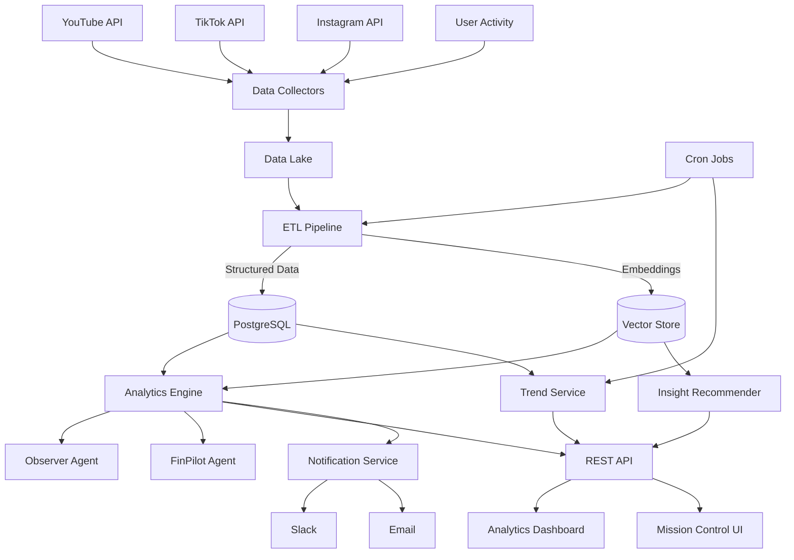
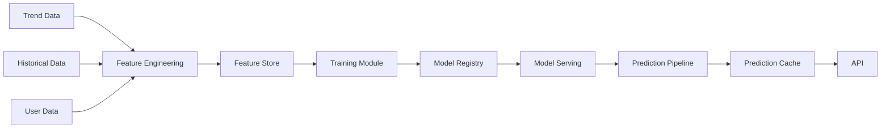

# Phase 2: High-Level Design (HLD)

This document outlines the high-level architecture and data flows for the Advanced Analytics features in Phase 2 of the Social-Intelligence service.

## System Architecture



## Component Details

### 1. Data Collectors
- **YouTubeCollector**: Enhanced API collector with category-aware parameters
- **CrossPlatformCollector**: New collector for TikTok and Instagram data
- **UserActivityTracker**: Captures analytics usage for personalization

### 2. Data Storage
- **PostgreSQL Extensions**:
  - New tables: `analytics_events`, `trend_cache`, `cross_platform_metrics`
  - Materialized views for common aggregations
- **Vector Store (Qdrant)**:
  - Content embeddings for similarity search
  - Trend vector representations for pattern matching

### 3. Analytics Services
- **Analytics Engine**: Core service for data processing and metric calculation
- **Trend Service**: Time-series analysis and forecasting
- **Insight Recommender**: ML-based recommendation system

### 4. Agent Integration
- **Observer Agent**: Monitors trends and sends notifications
- **FinPilot Agent**: Financial opportunity analysis and ROI predictions

### 5. API Layer
- New endpoints for analytics data
- Enhanced existing endpoints with analytics data enrichment
- Batch query capabilities for dashboard efficiency

### 6. User Interface
- Interactive analytics dashboard with D3.js visualizations
- Customizable reports and views
- Exportable insights and charts

## Data Flow

### Trend Analysis Flow
1. Data collectors gather platform-specific metrics
2. ETL processes and standardizes data into the warehouse
3. Analytics engine performs calculations and aggregations
4. Trend service applies time-series analysis and forecasting
5. Results are cached in `trend_cache` table for quick retrieval
6. API serves processed data to the dashboard

### Insight Generation Flow
1. Content and metric data is converted to vector embeddings
2. Vector store enables similarity and pattern searches
3. Insight Recommender identifies opportunities and correlations
4. Observer Agent monitors for significant pattern changes
5. Notification service alerts users to high-value insights
6. Dashboard presents actionable recommendations

### Cross-Platform Analysis Flow
1. Data from multiple platforms is normalized and aligned
2. ETL creates unified metrics across platforms
3. Analytics engine calculates correlation coefficients
4. API provides comparative analysis endpoints
5. Dashboard visualizes platform differences and opportunities

## Database Schema Changes

New tables to be added:

```sql
CREATE TABLE analytics_events (
  event_id BIGSERIAL PRIMARY KEY,
  event_type TEXT NOT NULL,
  event_source TEXT NOT NULL,
  event_timestamp TIMESTAMPTZ NOT NULL,
  event_data JSONB NOT NULL,
  user_id TEXT,
  niche_id BIGINT REFERENCES features(niche_id),
  created_at TIMESTAMPTZ DEFAULT now()
);

CREATE TABLE trend_cache (
  trend_id BIGSERIAL PRIMARY KEY,
  trend_type TEXT NOT NULL,
  trend_source TEXT NOT NULL,
  trend_data JSONB NOT NULL,
  parameters JSONB NOT NULL,
  valid_until TIMESTAMPTZ NOT NULL,
  created_at TIMESTAMPTZ DEFAULT now()
);

CREATE TABLE cross_platform_metrics (
  metric_id BIGSERIAL PRIMARY KEY,
  niche_id BIGINT REFERENCES features(niche_id),
  platform TEXT NOT NULL,
  demand_score NUMERIC(5,4),
  supply_score NUMERIC(5,4),
  engagement_score NUMERIC(5,4),
  growth_rate NUMERIC(5,4),
  updated_at TIMESTAMPTZ DEFAULT now()
);
```

## ML Pipeline



The ML pipeline includes:
- Daily retraining of trend forecasting models
- Weekly retraining of recommendation models
- A/B testing framework for model improvements
- Model versioning and rollback capabilities

## Integration Points

- **Mission Control**: Enhanced UI components for analytics
- **Financial-Tax Agent**: ROI projections based on content strategy
- **Legal Compliance**: Content recommendation filtering
- **Alfred Bot**: Trend alerts and insights via Slack