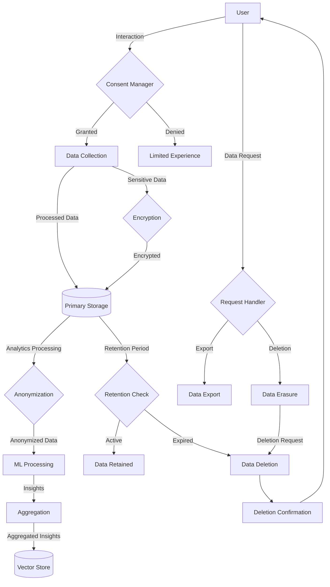

# Phase 2: Threat & Privacy Model

This document outlines the security and privacy considerations for the Advanced Analytics features in Phase 2 of the Social Intelligence service.

## Data Classification

| Data Type | Classification | Description | Storage Location | Retention |
|-----------|---------------|-------------|------------------|-----------|
| **User Activity Data** | Sensitive | User interactions with the platform | PostgreSQL (encrypted) | 24 months |
| **YouTube API Data** | Confidential | Data from YouTube API | Object Storage | 12 months |
| **Cross-Platform Data** | Confidential | Data from TikTok, Instagram | Object Storage | 12 months |
| **Authentication Tokens** | Restricted | API keys and access tokens | Vault | Until revoked |
| **Generated Insights** | Confidential | ML-generated recommendations | PostgreSQL | 12 months |
| **User Search Logs** | Sensitive | Keywords and search parameters | PostgreSQL (encrypted) | 6 months |
| **Vector Embeddings** | Internal | Content and trend embeddings | Vector Store | 12 months |

## Threat Model

### Authentication & Authorization

#### Threats
- Unauthorized access to analytics endpoints
- Permission escalation
- Session hijacking
- Credential theft

#### Mitigations
- Role-based access control (RBAC) for all analytics endpoints
- JWT with short expiration (15 minutes)
- API key rotation every 30 days
- OAuth 2.0 for platform integrations
- MFA for admin access
- IP-based rate limiting

### Data Security

#### Threats
- Data exfiltration
- Unauthorized data access
- Insider threats
- Storage compromise

#### Mitigations
- Encryption at rest (AES-256)
- Encryption in transit (TLS 1.3)
- Column-level encryption for PII
- Audit logging for all data access
- Access limited by least privilege principle
- Customer data isolation

### API Security

#### Threats
- API abuse and scraping
- Parameter tampering
- Rate limiting bypass
- SSRF attacks

#### Mitigations
- Rate limiting by user and IP
- Request validation
- API key restrictions by route
- Input sanitization
- Output encoding
- Throttling for suspicious patterns
- HTTPS-only communication

### ML Model Security

#### Threats
- Model poisoning
- Adversarial inputs
- Feature extraction
- Inference attacks

#### Mitigations
- Input validation for model inputs
- Anomaly detection for training data
- Model versioning and rollback capability
- Limited prediction output detail
- Rate limiting on model endpoints
- Model predictions auditing

## Privacy Controls

### User Data

- **Consent Management**:
  - Explicit opt-in for analytics tracking
  - Granular consent options by data category
  - Clear privacy notices before data collection
  - Revocation mechanism with immediate effect

- **Data Minimization**:
  - Collection limited to specified purposes
  - Automatic data reduction after processing
  - Pseudonymization where possible
  - Regular PII scanning and redaction

- **Subject Rights**:
  - Self-service data export
  - Right to erasure workflow
  - Preference management
  - Activity history and insights control

### Platform Integration Data

- **YouTube Data**:
  - Limited to public metrics and trends
  - Creator-specific data requires explicit consent
  - No storage of watch history or private engagement
  - Aggregated for analysis when possible

- **Cross-Platform Data**:
  - Stored with platform-specific access controls
  - Source attribution maintained
  - Restricted API access by role
  - No cross-platform identity linking without consent

## Compliance Checkpoints

| Regulation | Checkpoint | Implementation |
|------------|------------|----------------|
| **GDPR** | Lawful basis | Consent tracking system |
| **GDPR** | Data subject rights | Self-service portal |
| **GDPR** | Data minimization | Automated data pruning |
| **GDPR** | Data protection | Encryption and access controls |
| **CCPA** | Right to delete | API endpoint for deletion requests |
| **CCPA** | Right to know | Data inventory API |
| **CCPA** | Opt-out of sale | Data sharing controls |
| **YouTube ToS** | API usage | Compliance with quota limitations |
| **YouTube ToS** | Data retention | 12-month auto-deletion |
| **Internal** | Ethical AI | Bias detection in ML models |

## Data Flow & Privacy Controls

## Security Controls Implementation

### Encryption

- **At Rest**:
  - PostgreSQL: Transparent Data Encryption (TDE)
  - Object Storage: Server-side encryption
  - Vector Store: Encrypted indices

- **In Transit**:
  - TLS 1.3 for all API communication
  - Certificate pinning for internal services
  - Perfect Forward Secrecy (PFS)

- **Application-Level**:
  - Sensitive fields encrypted with AES-256-GCM
  - Key rotation every 90 days
  - Separate encryption contexts by data category

### Access Controls

- **Authentication**:
  - JWT tokens with 15-minute expiration
  - API keys with role-specific permissions
  - OAuth 2.0 for service-to-service

- **Authorization**:
  - Role-based access control (RBAC)
  - Attribute-based access control (ABAC) for sensitive operations
  - Temporary elevated access with approval workflow

- **Audit & Monitoring**:
  - All data access logged to immutable store
  - Real-time anomaly detection
  - Privileged access alerts

## Incident Response

### Data Breach Response

1. **Detection**:
   - Automated alerts for suspicious access patterns
   - Monitoring for unusual data movement
   - Regular permission audits

2. **Containment**:
   - Automatic credential revocation
   - Service isolation capabilities
   - API throttling for affected endpoints

3. **Notification**:
   - Predefined communication templates
   - Regulatory notification process
   - User notification workflow

4. **Recovery**:
   - Secure rollback procedures
   - Data restoration from clean backups
   - Post-incident security review

## Privacy Impact Assessment

A full Privacy Impact Assessment has been conducted for Phase 2 with the following key findings:

1. **Data Collection Expansion**: Cross-platform data integration introduces new privacy considerations that require enhanced consent management.

2. **ML Model Risks**: Inference from combined data sources could potentially reveal patterns not explicitly collected, requiring additional safeguards.

3. **Data Retention Complexity**: Different retention requirements across data sources and regions require a more sophisticated data lifecycle management approach.

4. **Mitigation Measures**: Additional controls have been implemented including enhanced anonymization, stricter access controls, and expanded user privacy controls.

## Third-Party Security Assessment

An independent security assessment will be conducted prior to launch with focus on:

1. Penetration testing of new API endpoints
2. Code review of data processing components
3. Infrastructure security assessment
4. Data privacy compliance review

## Security & Privacy Team

- **Security Lead**: [Name]
- **Privacy Officer**: [Name]
- **Compliance Manager**: [Name]
- **Data Protection Contact**: privacy@example.com