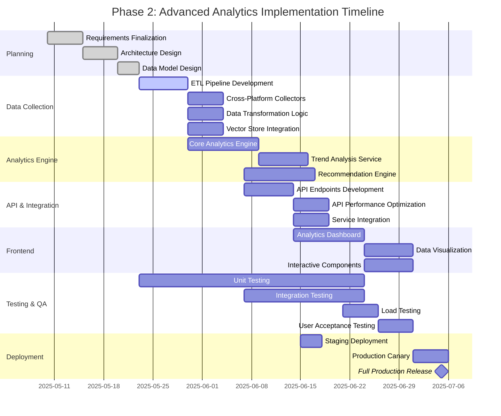

# Phase 2: Advanced Analytics Timeline

This document outlines the development and implementation timeline for Phase 2 (Advanced Analytics) of the Social Intelligence service.

## Executive Summary

Phase 2 will be implemented over a 6-week period with well-defined milestones. The project follows a staged delivery approach with continuous integration and weekly releases to staging for stakeholder feedback.

## Timeline Gantt Chart

## Detailed Milestone Plan

### Week 1 (2025-05-10 to 2025-05-17)
- **Planning & Design Phase**
  - Requirements freeze
  - Technical architecture design
  - Data model design
  - API contract definition
  - Testing strategy development

**Milestone**: Architecture and data model approved

### Week 2 (2025-05-18 to 2025-05-24)
- **Data Collection Framework**
  - Database migration implementation
  - ETL pipeline core development
  - Base collector infrastructure

**Milestone**: Database schema migrations successful in staging

### Week 3 (2025-05-25 to 2025-05-31)
- **Data Processing**
  - Cross-platform data collectors
  - Data transformation pipeline
  - Vector embedding generation
  - Initial storage integration

**Milestone**: Data pipeline processing sample data end-to-end

### Week 4 (2025-06-01 to 2025-06-07)
- **Analytics Engine Core**
  - Core analytics calculations
  - Trend analysis service
  - Initial ML pipeline implementation
  - Time-series forecasting models

**Milestone**: Analytics engine generating valid insights

### Week 5 (2025-06-08 to 2025-06-14)
- **API & Integration**
  - API endpoints implementation
  - Integration with existing services
  - Performance optimization
  - Documentation generation

**Milestone**: API endpoints passing integration tests

### Week 6 (2025-06-15 to 2025-06-21)
- **Frontend & User Experience**
  - Analytics dashboard implementation
  - Data visualization components
  - Interactive analytics features
  - Responsive design implementation

**Milestone**: Dashboard UI complete and integrated with API

### Week 7 (2025-06-22 to 2025-06-28)
- **Testing & Quality Assurance**
  - End-to-end testing
  - Performance & load testing
  - Security testing
  - User acceptance testing

**Milestone**: All tests passing, performance criteria met

### Week 8 (2025-06-29 to 2025-07-05)
- **Deployment & Rollout**
  - Production deployment preparation
  - Canary release (10% → 100%)
  - Post-deployment monitoring
  - Final documentation updates

**Milestone**: Full production release

## Weekly Delivery Cadence

| Week # | Dev Complete | Testing | Staging Release | Demo |
|--------|--------------|---------|-----------------|------|
| Week 1 | Architecture | Design Review | N/A | Architecture |
| Week 2 | DB Schema | Migration Tests | DB Schema | Data Model |
| Week 3 | ETL Pipeline | Integration Tests | ETL Features | Data Pipeline |
| Week 4 | Analytics Core | Unit Tests | Analytics API | Initial Insights |
| Week 5 | API Layer | API Tests | Full API | API Capabilities |
| Week 6 | Dashboard UI | UI Tests | Dashboard Beta | Dashboard Demo |
| Week 7 | Final Features | E2E Tests | Release Candidate | Full Feature Demo |
| Week 8 | Final Fixes | Production Validation | Production | Launch Review |

## Dependencies & Critical Path

The following dependencies represent the critical path for the project:

1. **Data Collection → Analytics Engine**
   - Analytics requires processed data
   - Blocked by data pipeline completion

2. **Analytics Engine → API Layer**
   - API endpoints rely on analytics capabilities
   - Blocked by core analytics implementation

3. **API Layer → Frontend**
   - Dashboard requires functional API endpoints
   - Blocked by API implementation and testing

## Resource Allocation

| Team | Week 1-2 | Week 3-4 | Week 5-6 | Week 7-8 |
|------|---------|----------|----------|----------|
| **Backend** | Data Pipeline | Analytics Engine | API Layer | Support |
| **Data Science** | Data Models | ML Models | Optimization | Calibration |
| **Frontend** | Planning | Component Design | Dashboard | Refinement |
| **QA** | Test Planning | Pipeline Testing | API Testing | E2E Testing |
| **DevOps** | Env Setup | Monitoring | Performance | Deployment |

## Risk Assessment & Mitigation

| Risk | Impact | Probability | Mitigation |
|------|--------|------------|------------|
| Data pipeline performance issues | High | Medium | Early performance testing, optimization sprints |
| ML model accuracy below target | High | Medium | Fallback to rule-based approach if needed |
| API latency above threshold | High | Low | Performance optimization focus in Week 5 |
| Integration delays with platform | Medium | Medium | Clear API contracts, mock endpoints |
| Frontend complexity underestimated | Medium | Medium | Component-based approach, early prototyping |
| Last-minute security issues | High | Low | Security reviews in each phase |

## Progress Tracking

Weekly status updates will be provided with the following metrics:

- **Completion Percentage**: Story points completed vs. total
- **Test Coverage**: Percentage of code covered by tests
- **Performance Metrics**: Current vs. target performance
- **Bug Count**: Open bugs by severity
- **Milestone Status**: On track / At risk / Off track

## Communication Plan

| Event | Frequency | Participants | Purpose |
|-------|-----------|--------------|---------|
| Daily Standup | Daily | Development Team | Status update, blocker removal |
| Sprint Review | Weekly | Dev Team + Stakeholders | Demo progress, gather feedback |
| Technical Sync | Weekly | Tech Leads | Address technical challenges |
| Executive Update | Bi-weekly | Project Lead + Execs | Status summary, resource needs |

## Responsible Team

- **Project Lead**: 
- **Backend Lead**: 
- **Data Science Lead**: 
- **Frontend Lead**: 
- **QA Lead**: 
- **DevOps Lead**: