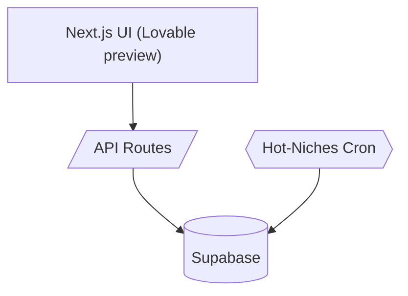

# Architecture

## Components
* **Next.js** – App Router, shadcn/ui
* **Supabase** – Postgres + RLS + Edge Functions
* **Cron** – Node job scoring opportunity data
* **CI** – GitHub Actions: lint → test → preview

## Data flow
1. Cron scores categories → `taxonomy_dynamic`
2. Wizard fetches **GET /api/taxonomy/hot**
3. User runs workflow → payload stored in `runs`