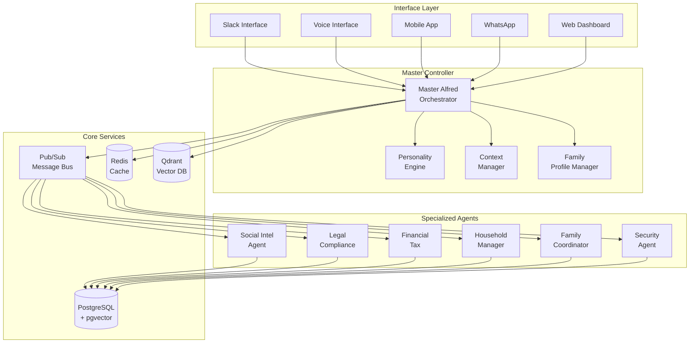

# Batman's Alfred AI Assistant - Technical Architecture

## System Architecture Overview



## Component Architecture

### 1. Master Alfred Service

```python
# services/master-alfred/app/core/master_alfred.py
from typing import Dict, Any, Optional
import structlog
from datetime import datetime

from libs.agent_core import BaseAgent
from libs.a2a_adapter import A2AEnvelope, A2AResponse
from app.personality.engine import AlfredPersonality
from app.context.manager import ContextManager
from app.family.profiles import FamilyProfileManager
from app.proactive.monitor import ProactiveMonitor

logger = structlog.get_logger(__name__)

class MasterAlfredAgent(BaseAgent):
    """
    Master Alfred Orchestrator - The central controller for all Alfred operations.
    Manages personality, context, family profiles, and agent coordination.
    """
    
    def __init__(self):
        super().__init__(
            name="master-alfred",
            version="2.0.0",
            supported_intents=[
                # Core Alfred Operations
                "GENERAL_ASSISTANCE",
                "FAMILY_COORDINATION",
                "BUSINESS_SUPPORT",
                "EMERGENCY_RESPONSE",
                "PROACTIVE_SUGGESTION",
                
                # Interface-specific intents
                "VOICE_COMMAND",
                "MOBILE_REQUEST",
                "WHATSAPP_MESSAGE",
                "WEB_INTERACTION",
                
                # Orchestration intents
                "DELEGATE_TO_AGENT",
                "AGGREGATE_RESPONSES",
                "PRIORITY_OVERRIDE"
            ]
        )
        
        self.personality_engine = AlfredPersonality()
        self.context_manager = ContextManager()
        self.family_profiles = FamilyProfileManager()
        self.proactive_monitor = ProactiveMonitor()
        self.agent_coordinator = AgentCoordinator()
        
    async def process_task(self, envelope: A2AEnvelope) -> Dict[str, Any]:
        """Process incoming requests with Alfred's personality and context awareness."""
        try:
            # Extract user context
            user_id = envelope.content.get("user_id")
            interface = envelope.content.get("interface", "unknown")
            
            # Get family profile
            family_member = await self.family_profiles.get_member(user_id)
            if not family_member:
                family_member = await self.family_profiles.create_guest_profile(user_id)
            
            # Get context
            context = await self.context_manager.get_context(
                user_id=user_id,
                family_member=family_member,
                interface=interface,
                intent=envelope.intent
            )
            
            # Apply personality to request processing
            enhanced_envelope = await self.personality_engine.process_envelope(
                envelope=envelope,
                context=context
            )
            
            # Route to appropriate handler
            response = await self._route_request(enhanced_envelope, context)
            
            # Apply personality to response
            final_response = await self.personality_engine.format_response(
                response=response,
                context=context,
                family_member=family_member
            )
            
            # Update context for future interactions
            await self.context_manager.update_context(user_id, envelope, final_response)
            
            return final_response
            
        except Exception as e:
            logger.error("master_alfred_error", error=str(e), task_id=envelope.task_id)
            return self._create_error_response(e, envelope)
    
    async def _route_request(self, envelope: A2AEnvelope, context: Dict[str, Any]) -> Dict[str, Any]:
        """Route requests to appropriate handlers or delegate to other agents."""
        
        # Check for emergency situations
        if self._is_emergency(envelope, context):
            return await self._handle_emergency(envelope, context)
        
        # Handle directly if within Master Alfred's capabilities
        if envelope.intent in self._get_direct_handlers():
            handler = self._get_direct_handlers()[envelope.intent]
            return await handler(envelope, context)
        
        # Delegate to specialized agents
        return await self.agent_coordinator.delegate(envelope, context)
    
    def _get_direct_handlers(self) -> Dict[str, callable]:
        """Get handlers for intents processed directly by Master Alfred."""
        return {
            "GENERAL_ASSISTANCE": self._handle_general_assistance,
            "FAMILY_COORDINATION": self._handle_family_coordination,
            "EMERGENCY_RESPONSE": self._handle_emergency,
            "PROACTIVE_SUGGESTION": self._handle_proactive_suggestion,
        }
    
    async def _handle_general_assistance(self, envelope: A2AEnvelope, context: Dict[str, Any]) -> Dict[str, Any]:
        """Handle general assistance requests with Alfred's personality."""
        query = envelope.content.get("query", "")
        
        # Use LangChain for intelligent response generation
        response = await self.conversation_chain.arun(
            query=query,
            context=context,
            personality=self.personality_engine.get_traits()
        )
        
        return {
            "status": "success",
            "response": response,
            "suggestions": await self._generate_follow_up_suggestions(query, context)
        }
```

### 2. Personality Engine Implementation

```python
# services/master-alfred/app/personality/engine.py
from typing import Dict, Any, Optional
import structlog
from datetime import datetime
import random

logger = structlog.get_logger(__name__)

class AlfredPersonality:
    """
    Alfred's personality engine - defines behavioral traits and response patterns
    based on Batman's Alfred characteristics.
    """
    
    def __init__(self):
        self.traits = {
            "discretion": 0.95,      # High privacy and confidentiality
            "anticipatory": 0.85,    # Proactive service orientation
            "warmth": 0.75,          # Balanced professionalism with care
            "formality": 0.80,       # Proper but not stiff
            "wit": 0.70,             # Subtle humor when appropriate
            "crisis_competence": 0.95,  # Excellent under pressure
            "loyalty": 1.0           # Absolute dedication to family
        }
        
        self.response_templates = self._load_response_templates()
        self.crisis_protocols = self._load_crisis_protocols()
    
    async def process_envelope(self, envelope: A2AEnvelope, context: Dict[str, Any]) -> A2AEnvelope:
        """Apply personality traits to incoming request processing."""
        # Analyze request tone and urgency
        urgency = self._assess_urgency(envelope, context)
        formality_needed = self._determine_formality(context)
        
        # Enhance envelope with personality metadata
        envelope.metadata.update({
            "personality_traits": self.traits,
            "urgency_level": urgency,
            "formality_level": formality_needed,
            "interaction_style": self._get_interaction_style(context)
        })
        
        return envelope
    
    async def format_response(self, response: Dict[str, Any], context: Dict[str, Any], family_member: Dict[str, Any]) -> Dict[str, Any]:
        """Format response according to Alfred's personality and family member preferences."""
        # Get appropriate communication style
        style = self._get_communication_style(family_member, context)
        
        # Apply personality traits to response
        formatted_response = self._apply_personality_to_response(response, style)
        
        # Add Alfred's signature touches
        formatted_response = self._add_alfred_touches(formatted_response, context)
        
        return formatted_response
    
    def _get_communication_style(self, family_member: Dict[str, Any], context: Dict[str, Any]) -> str:
        """Determine appropriate communication style based on family member and context."""
        role = family_member.get("role", "guest")
        age_group = family_member.get("age_group", "adult")
        situation = context.get("situation", "normal")
        
        if situation == "emergency":
            return "crisis_mode"
        
        if role == "child":
            return "gentle_educational"
        elif role == "parent" and situation == "business":
            return "professional_efficient"
        elif role == "parent" and situation == "family":
            return "warm_supportive"
        else:
            return "polite_professional"
    
    def _add_alfred_touches(self, response: Dict[str, Any], context: Dict[str, Any]) -> Dict[str, Any]:
        """Add Alfred's characteristic touches to responses."""
        # Add subtle wit if appropriate
        if context.get("mood") == "light" and self.traits["wit"] > random.random():
            response["subtle_humor"] = self._get_witty_remark(context)
        
        # Add anticipatory suggestions
        if self.traits["anticipatory"] > random.random():
            response["proactive_suggestions"] = self._get_anticipatory_suggestions(context)
        
        # Add discreet reminders if needed
        if context.get("pending_tasks"):
            response["gentle_reminders"] = self._format_reminders(context["pending_tasks"])
        
        return response
    
    def _assess_urgency(self, envelope: A2AEnvelope, context: Dict[str, Any]) -> float:
        """Assess the urgency level of a request."""
        # Check for emergency keywords
        emergency_keywords = ["urgent", "emergency", "help", "immediately", "crisis"]
        content_text = str(envelope.content).lower()
        
        urgency_score = 0.0
        
        # Check for emergency keywords
        for keyword in emergency_keywords:
            if keyword in content_text:
                urgency_score += 0.3
        
        # Check context flags
        if context.get("is_emergency", False):
            urgency_score = 1.0
        
        # Check time sensitivity
        if envelope.timeout_seconds < 60:
            urgency_score += 0.2
        
        return min(urgency_score, 1.0)
```

### 3. Family Profile Management

```python
# services/master-alfred/app/family/profiles.py
from typing import Dict, Any, Optional, List
import structlog
from datetime import datetime, time
from enum import Enum
import json

logger = structlog.get_logger(__name__)

class FamilyRole(Enum):
    PARENT = "parent"
    CHILD = "child"
    TEEN = "teen"
    EXTENDED = "extended"
    GUEST = "guest"
    STAFF = "staff"

class FamilyProfile:
    """
    Comprehensive family member profile with preferences, permissions, and routines.
    """
    
    def __init__(self, member_id: str, role: FamilyRole, name: str):
        self.member_id = member_id
        self.role = role
        self.name = name
        self.created_at = datetime.utcnow()
        
        # Personal information
        self.age_group = self._determine_age_group()
        self.preferred_name = name
        self.voice_profile = None
        self.biometric_data = {}
        
        # Preferences
        self.preferences = {
            "communication_style": self._default_communication_style(),
            "notification_settings": self._default_notification_settings(),
            "privacy_level": self._default_privacy_level(),
            "language": "en",
            "timezone": "UTC"
        }
        
        # Permissions
        self.permissions = self._default_permissions()
        
        # Daily routines and patterns
        self.routines = {
            "wake_time": None,
            "sleep_time": None,
            "work_schedule": {},
            "meal_times": [],
            "medication_schedule": [],
            "exercise_routine": []
        }
        
        # Relationships
        self.relationships = {}
        
        # Activity tracking
        self.activity_log = []
        self.interaction_history = []
    
    def _determine_age_group(self) -> str:
        """Determine age group based on role."""
        if self.role == FamilyRole.CHILD:
            return "child"
        elif self.role == FamilyRole.TEEN:
            return "teen"
        else:
            return "adult"
    
    def _default_communication_style(self) -> Dict[str, Any]:
        """Get default communication style based on role."""
        styles = {
            FamilyRole.PARENT: {
                "formality": "balanced",
                "detail_level": "comprehensive",
                "humor_allowed": True,
                "proactive_suggestions": True
            },
            FamilyRole.CHILD: {
                "formality": "friendly",
                "detail_level": "simple",
                "humor_allowed": True,
                "proactive_suggestions": True,
                "educational_tone": True
            },
            FamilyRole.TEEN: {
                "formality": "casual",
                "detail_level": "moderate",
                "humor_allowed": True,
                "proactive_suggestions": True
            },
            FamilyRole.GUEST: {
                "formality": "polite",
                "detail_level": "essential",
                "humor_allowed": False,
                "proactive_suggestions": False
            }
        }
        return styles.get(self.role, styles[FamilyRole.GUEST])
    
    def _default_permissions(self) -> Dict[str, bool]:
        """Get default permissions based on role."""
        permissions = {
            FamilyRole.PARENT: {
                "financial_access": True,
                "security_control": True,
                "family_calendar": True,
                "guest_management": True,
                "system_settings": True,
                "emergency_override": True
            },
            FamilyRole.CHILD: {
                "financial_access": False,
                "security_control": False,
                "family_calendar": "read_only",
                "guest_management": False,
                "system_settings": False,
                "emergency_override": False
            },
            FamilyRole.GUEST: {
                "financial_access": False,
                "security_control": False,
                "family_calendar": False,
                "guest_management": False,
                "system_settings": False,
                "emergency_override": False
            }
        }
        return permissions.get(self.role, permissions[FamilyRole.GUEST])
    
    def update_routine(self, routine_type: str, data: Dict[str, Any]):
        """Update a specific routine for the family member."""
        if routine_type in self.routines:
            self.routines[routine_type] = data
            logger.info("routine_updated", member_id=self.member_id, routine=routine_type)
    
    def check_permission(self, action: str) -> bool:
        """Check if member has permission for specific action."""
        return self.permissions.get(action, False)
    
    def get_current_context(self) -> Dict[str, Any]:
        """Get current context based on time and routines."""
        current_time = datetime.now().time()
        context = {
            "time_of_day": self._get_time_period(current_time),
            "expected_activity": self._get_expected_activity(current_time),
            "mood_estimate": self._estimate_mood(),
            "recent_interactions": self.interaction_history[-5:] if self.interaction_history else []
        }
        return context
```

### 4. Proactive Monitoring System

```python
# services/master-alfred/app/proactive/monitor.py
import asyncio
from typing import Dict, Any, List
import structlog
from datetime import datetime, timedelta
from app.analysis.pattern_analyzer import PatternAnalyzer
from app.suggestions.engine import SuggestionEngine

logger = structlog.get_logger(__name__)

class ProactiveMonitor:
    """
    Continuously monitors family patterns and generates proactive suggestions.
    """
    
    def __init__(self):
        self.pattern_analyzer = PatternAnalyzer()
        self.suggestion_engine = SuggestionEngine()
        self.monitoring_interval = 300  # 5 minutes
        self.active_monitors = {}
    
    async def start_monitoring(self):
        """Start the proactive monitoring loop."""
        logger.info("proactive_monitoring_started")
        
        while True:
            try:
                await self._monitoring_cycle()
            except Exception as e:
                logger.error("monitoring_cycle_error", error=str(e))
            
            await asyncio.sleep(self.monitoring_interval)
    
    async def _monitoring_cycle(self):
        """Execute one monitoring cycle."""
        # Get all active family members
        family_members = await self._get_active_family_members()
        
        for member in family_members:
            try:
                # Analyze patterns for each member
                patterns = await self.pattern_analyzer.analyze_member_patterns(member)
                
                # Generate suggestions based on patterns
                suggestions = await self.suggestion_engine.generate_suggestions(
                    member=member,
                    patterns=patterns
                )
                
                # Process and deliver suggestions
                await self._process_suggestions(member, suggestions)
                
            except Exception as e:
                logger.error("member_monitoring_error", 
                           member_id=member.member_id, 
                           error=str(e))
    
    async def _process_suggestions(self, member: FamilyProfile, suggestions: List[Dict[str, Any]]):
        """Process and deliver suggestions to family members."""
        for suggestion in suggestions:
            # Check if suggestion is appropriate for current context
            if await self._should_deliver_suggestion(member, suggestion):
                await self._deliver_suggestion(member, suggestion)
    
    async def _should_deliver_suggestion(self, member: FamilyProfile, suggestion: Dict[str, Any]) -> bool:
        """Determine if a suggestion should be delivered based on context and preferences."""
        # Check member preferences
        if not member.preferences.get("proactive_suggestions", True):
            return False
        
        # Check timing appropriateness
        current_time = datetime.now().time()
        if not self._is_appropriate_time(member, current_time):
            return False
        
        # Check suggestion priority and member's current activity
        if suggestion.get("priority", 0) < 3 and member.get_current_context().get("busy", False):
            return False
        
        return True
    
    async def _deliver_suggestion(self, member: FamilyProfile, suggestion: Dict[str, Any]):
        """Deliver a suggestion through appropriate channel."""
        # Create A2A envelope for the suggestion
        envelope = A2AEnvelope(
            intent="PROACTIVE_SUGGESTION",
            content={
                "suggestion": suggestion,
                "member_id": member.member_id,
                "delivery_channel": self._get_preferred_channel(member)
            },
            priority=suggestion.get("priority", 2)
        )
        
        # Publish through appropriate transport
        await self.pubsub_transport.publish_task(envelope)
        
        # Log delivery
        logger.info("suggestion_delivered",
                   member_id=member.member_id,
                   suggestion_type=suggestion.get("type"))
```

### 5. Voice Interface Integration

```python
# services/voice-processor/app/main.py
from fastapi import FastAPI, WebSocket, WebSocketDisconnect
import speech_recognition as sr
from gtts import gTTS
import io
import base64
import structlog
from typing import Dict, Any

from libs.a2a_adapter import A2AEnvelope, PubSubTransport

logger = structlog.get_logger(__name__)

app = FastAPI(title="Voice Processor")

class VoiceProcessor:
    def __init__(self):
        self.recognizer = sr.Recognizer()
        self.pubsub_transport = PubSubTransport()
    
    async def process_audio(self, audio_data: bytes) -> str:
        """Convert audio to text using speech recognition."""
        try:
            audio = sr.AudioData(audio_data, sample_rate=16000, sample_width=2)
            text = self.recognizer.recognize_google(audio)
            return text
        except Exception as e:
            logger.error("speech_recognition_error", error=str(e))
            raise
    
    async def synthesize_speech(self, text: str) -> bytes:
        """Convert text to speech using gTTS."""
        try:
            tts = gTTS(text=text, lang='en', slow=False)
            audio_buffer = io.BytesIO()
            tts.write_to_fp(audio_buffer)
            audio_buffer.seek(0)
            return audio_buffer.read()
        except Exception as e:
            logger.error("speech_synthesis_error", error=str(e))
            raise

voice_processor = VoiceProcessor()

@app.websocket("/ws/voice")
async def voice_websocket(websocket: WebSocket):
    """WebSocket endpoint for real-time voice processing."""
    await websocket.accept()
    
    try:
        while True:
            # Receive audio data from client
            data = await websocket.receive_json()
            
            if data.get("type") == "audio":
                # Process voice command
                audio_bytes = base64.b64decode(data["audio"])
                text = await voice_processor.process_audio(audio_bytes)
                
                # Create envelope for Master Alfred
                envelope = A2AEnvelope(
                    intent="VOICE_COMMAND",
                    content={
                        "command": text,
                        "user_id": data.get("user_id"),
                        "voice_profile": data.get("voice_profile")
                    }
                )
                
                # Send to Master Alfred
                response = await voice_processor.pubsub_transport.publish_task_and_wait(envelope)
                
                # Synthesize response
                response_audio = await voice_processor.synthesize_speech(response["content"]["message"])
                
                # Send back to client
                await websocket.send_json({
                    "type": "response",
                    "text": response["content"]["message"],
                    "audio": base64.b64encode(response_audio).decode()
                })
    
    except WebSocketDisconnect:
        logger.info("voice_websocket_disconnected")
    except Exception as e:
        logger.error("voice_websocket_error", error=str(e))
        await websocket.close()
```

### 6. Mobile API Layer

```python
# services/mobile-api/app/main.py
from fastapi import FastAPI, Depends, HTTPException, Security
from fastapi.security import HTTPBearer, HTTPAuthorizationCredentials
import jwt
from typing import Dict, Any
import structlog

from app.models.requests import MobileRequest, NotificationPreferences
from libs.a2a_adapter import A2AEnvelope, PubSubTransport

logger = structlog.get_logger(__name__)

app = FastAPI(title="Alfred Mobile API")
security = HTTPBearer()
pubsub_transport = PubSubTransport()

async def verify_token(credentials: HTTPAuthorizationCredentials = Security(security)):
    """Verify JWT token for mobile authentication."""
    try:
        payload = jwt.decode(
            credentials.credentials,
            app.state.jwt_secret,
            algorithms=["HS256"]
        )
        return payload
    except jwt.ExpiredSignatureError:
        raise HTTPException(status_code=401, detail="Token expired")
    except jwt.InvalidTokenError:
        raise HTTPException(status_code=401, detail="Invalid token")

@app.post("/api/v1/command")
async def process_mobile_command(
    request: MobileRequest,
    user_data: Dict = Depends(verify_token)
):
    """Process command from mobile app."""
    envelope = A2AEnvelope(
        intent="MOBILE_REQUEST",
        content={
            "command": request.command,
            "user_id": user_data["user_id"],
            "context": request.context,
            "location": request.location
        }
    )
    
    response = await pubsub_transport.publish_task_and_wait(envelope)
    return response

@app.post("/api/v1/notifications/preferences")
async def update_notification_preferences(
    preferences: NotificationPreferences,
    user_data: Dict = Depends(verify_token)
):
    """Update user notification preferences."""
    envelope = A2AEnvelope(
        intent="UPDATE_PREFERENCES",
        content={
            "user_id": user_data["user_id"],
            "preferences": preferences.dict()
        }
    )
    
    response = await pubsub_transport.publish_task_and_wait(envelope)
    return response

@app.websocket("/ws/notifications")
async def notification_websocket(websocket: WebSocket):
    """WebSocket for real-time notifications to mobile app."""
    await websocket.accept()
    
    try:
        # Authenticate websocket connection
        token = await websocket.receive_text()
        user_data = verify_token(HTTPAuthorizationCredentials(credentials=token))
        
        # Subscribe to user's notification channel
        subscription = await pubsub_transport.subscribe_to_user_notifications(
            user_data["user_id"]
        )
        
        # Forward notifications to mobile app
        async for notification in subscription:
            await websocket.send_json(notification)
    
    except WebSocketDisconnect:
        logger.info("notification_websocket_disconnected")
    except Exception as e:
        logger.error("notification_websocket_error", error=str(e))
        await websocket.close()
```

## Database Schema Extensions

```sql
-- Family profiles and relationships
CREATE TABLE family_members (
    member_id UUID PRIMARY KEY DEFAULT uuid_generate_v4(),
    name TEXT NOT NULL,
    role TEXT NOT NULL CHECK (role IN ('parent', 'child', 'teen', 'extended', 'guest', 'staff')),
    age_group TEXT,
    created_at TIMESTAMPTZ DEFAULT NOW(),
    updated_at TIMESTAMPTZ DEFAULT NOW(),
    preferences JSONB DEFAULT '{}',
    permissions JSONB DEFAULT '{}',
    routines JSONB DEFAULT '{}',
    voice_profile JSONB,
    biometric_data JSONB
);

CREATE TABLE family_relationships (
    id UUID PRIMARY KEY DEFAULT uuid_generate_v4(),
    member_id UUID REFERENCES family_members(member_id),
    related_member_id UUID REFERENCES family_members(member_id),
    relationship_type TEXT NOT NULL,
    created_at TIMESTAMPTZ DEFAULT NOW()
);

-- Activity tracking
CREATE TABLE member_activities (
    id UUID PRIMARY KEY DEFAULT uuid_generate_v4(),
    member_id UUID REFERENCES family_members(member_id),
    activity_type TEXT NOT NULL,
    activity_data JSONB,
    timestamp TIMESTAMPTZ DEFAULT NOW()
);

-- Proactive suggestions
CREATE TABLE proactive_suggestions (
    id UUID PRIMARY KEY DEFAULT uuid_generate_v4(),
    member_id UUID REFERENCES family_members(member_id),
    suggestion_type TEXT NOT NULL,
    suggestion_data JSONB,
    priority INTEGER DEFAULT 1,
    delivered BOOLEAN DEFAULT FALSE,
    delivered_at TIMESTAMPTZ,
    response JSONB,
    created_at TIMESTAMPTZ DEFAULT NOW()
);

-- Voice interactions
CREATE TABLE voice_interactions (
    id UUID PRIMARY KEY DEFAULT uuid_generate_v4(),
    member_id UUID REFERENCES family_members(member_id),
    audio_transcript TEXT,
    intent TEXT,
    response_text TEXT,
    duration_ms INTEGER,
    created_at TIMESTAMPTZ DEFAULT NOW()
);

-- Emergency incidents
CREATE TABLE emergency_incidents (
    id UUID PRIMARY KEY DEFAULT uuid_generate_v4(),
    member_id UUID REFERENCES family_members(member_id),
    incident_type TEXT NOT NULL,
    severity_level INTEGER,
    description TEXT,
    response_actions JSONB,
    resolved BOOLEAN DEFAULT FALSE,
    resolved_at TIMESTAMPTZ,
    created_at TIMESTAMPTZ DEFAULT NOW()
);

-- Indexes for performance
CREATE INDEX idx_family_members_role ON family_members(role);
CREATE INDEX idx_member_activities_member_timestamp ON member_activities(member_id, timestamp);
CREATE INDEX idx_proactive_suggestions_member_delivered ON proactive_suggestions(member_id, delivered);
CREATE INDEX idx_voice_interactions_member_created ON voice_interactions(member_id, created_at);
CREATE INDEX idx_emergency_incidents_resolved ON emergency_incidents(resolved, created_at);
```

## Deployment Configuration

```yaml
# docker-compose.alfred-enhanced.yml
version: '3.8'

services:
  master-alfred:
    build: 
      context: ./services/master-alfred
      dockerfile: Dockerfile
    ports:
      - "8012:8012"
    environment:
      - OPENAI_API_KEY=${OPENAI_API_KEY}
      - REDIS_URL=redis://redis:6379
      - DATABASE_URL=${DATABASE_URL}
      - PUBSUB_PROJECT_ID=${GCP_PROJECT_ID}
      - LOG_LEVEL=INFO
    depends_on:
      - redis
      - supabase-db
      - pubsub-emulator
    healthcheck:
      test: ["CMD", "curl", "-f", "http://localhost:8012/health/"]
      interval: 30s
      timeout: 10s
      retries: 3

  voice-processor:
    build: 
      context: ./services/voice-processor
      dockerfile: Dockerfile
    ports:
      - "8013:8013"
    environment:
      - GOOGLE_APPLICATION_CREDENTIALS=/app/credentials.json
      - REDIS_URL=redis://redis:6379
    volumes:
      - ./credentials:/app/credentials
    deploy:
      resources:
        reservations:
          devices:
            - driver: nvidia
              count: 1
              capabilities: [gpu]

  mobile-api:
    build: 
      context: ./services/mobile-api
      dockerfile: Dockerfile
    ports:
      - "8014:8014"
    environment:
      - JWT_SECRET=${JWT_SECRET}
      - DATABASE_URL=${DATABASE_URL}
      - REDIS_URL=redis://redis:6379
    depends_on:
      - redis
      - supabase-db

  family-dashboard:
    build:
      context: ./services/family-dashboard
      dockerfile: Dockerfile
    ports:
      - "3004:3004"
    environment:
      - NEXT_PUBLIC_API_URL=http://mobile-api:8014
      - NEXT_PUBLIC_WS_URL=ws://mobile-api:8014
    depends_on:
      - mobile-api

  # Enhanced monitoring for new services
  prometheus:
    volumes:
      - ./monitoring/prometheus-alfred.yml:/etc/prometheus/prometheus.yml
      - prometheus_data:/prometheus

  grafana:
    volumes:
      - ./monitoring/dashboards/alfred:/var/lib/grafana/dashboards/alfred
      - grafana_data:/var/lib/grafana

volumes:
  prometheus_data:
  grafana_data:
```

## Integration Points

### 1. Slack Integration Enhancement

```python
# services/alfred-bot/app/enhanced_commands.py
@slack_app.command("/alfred")
async def handle_enhanced_alfred_command(ack, body, client):
    """Enhanced Alfred command handler with Master Alfred integration."""
    await ack()
    
    user_id = body["user_id"]
    command_text = body.get("text", "").strip()
    
    # Create envelope for Master Alfred
    envelope = A2AEnvelope(
        intent="SLACK_COMMAND",
        content={
            "command": command_text,
            "user_id": user_id,
            "channel_id": body["channel_id"],
            "interface": "slack"
        }
    )
    
    # Send to Master Alfred instead of direct processing
    response = await pubsub_transport.publish_task_and_wait(envelope)
    
    # Format response for Slack
    await client.chat_postMessage(
        channel=body["channel_id"],
        text=response["content"]["message"],
        blocks=response["content"].get("slack_blocks", [])
    )
```

### 2. WhatsApp Integration

```python
# services/master-alfred/app/interfaces/whatsapp.py
from twilio.rest import Client
from fastapi import APIRouter, Request
import structlog

router = APIRouter(prefix="/whatsapp")
logger = structlog.get_logger(__name__)

@router.post("/webhook")
async def whatsapp_webhook(request: Request):
    """Handle incoming WhatsApp messages."""
    data = await request.form()
    
    from_number = data.get("From")
    message_body = data.get("Body")
    
    # Create envelope for Master Alfred
    envelope = A2AEnvelope(
        intent="WHATSAPP_MESSAGE",
        content={
            "from": from_number,
            "message": message_body,
            "interface": "whatsapp"
        }
    )
    
    # Process through Master Alfred
    response = await pubsub_transport.publish_task_and_wait(envelope)
    
    # Send response back via Twilio
    twilio_client = Client(account_sid, auth_token)
    twilio_client.messages.create(
        body=response["content"]["message"],
        from_=whatsapp_number,
        to=from_number
    )
    
    return {"status": "ok"}
```

## Monitoring and Observability

```yaml
# monitoring/dashboards/alfred/master-dashboard.json
{
  "dashboard": {
    "title": "Master Alfred Dashboard",
    "panels": [
      {
        "title": "Request Volume by Interface",
        "type": "graph",
        "targets": [
          {
            "expr": "sum(rate(alfred_requests_total{service=\"master-alfred\"}[5m])) by (interface)"
          }
        ]
      },
      {
        "title": "Family Member Activity",
        "type": "heatmap",
        "targets": [
          {
            "expr": "sum(rate(alfred_member_activity_total[1h])) by (member_id, hour)"
          }
        ]
      },
      {
        "title": "Proactive Suggestions",
        "type": "stat",
        "targets": [
          {
            "expr": "sum(rate(alfred_suggestions_delivered_total[24h]))"
          }
        ]
      },
      {
        "title": "Emergency Response Time",
        "type": "gauge",
        "targets": [
          {
            "expr": "histogram_quantile(0.95, rate(alfred_emergency_response_duration_seconds_bucket[5m]))"
          }
        ]
      }
    ]
  }
}
```

## Security Implementation

```python
# services/master-alfred/app/security/encryption.py
from cryptography.fernet import Fernet
from cryptography.hazmat.primitives import hashes
from cryptography.hazmat.primitives.kdf.pbkdf2 import PBKDF2HMAC
import base64
import os

class SecureDataManager:
    """Manages encryption for sensitive family data."""
    
    def __init__(self):
        self.master_key = os.environ.get("ALFRED_MASTER_KEY")
        self.fernet = self._initialize_encryption()
    
    def _initialize_encryption(self):
        """Initialize Fernet encryption with master key."""
        kdf = PBKDF2HMAC(
            algorithm=hashes.SHA256(),
            length=32,
            salt=os.environ.get("ALFRED_SALT").encode(),
            iterations=100000,
        )
        key = base64.urlsafe_b64encode(kdf.derive(self.master_key.encode()))
        return Fernet(key)
    
    def encrypt_sensitive_data(self, data: str) -> str:
        """Encrypt sensitive data."""
        return self.fernet.encrypt(data.encode()).decode()
    
    def decrypt_sensitive_data(self, encrypted_data: str) -> str:
        """Decrypt sensitive data."""
        return self.fernet.decrypt(encrypted_data.encode()).decode()
```

This technical architecture provides a comprehensive foundation for implementing the Batman's Alfred AI Assistant, with all the necessary components for multi-interface support, personality engine, family management, and proactive assistance capabilities.
