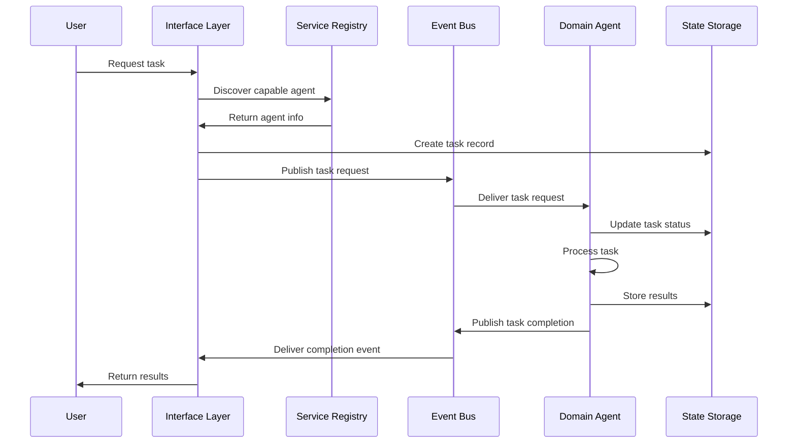
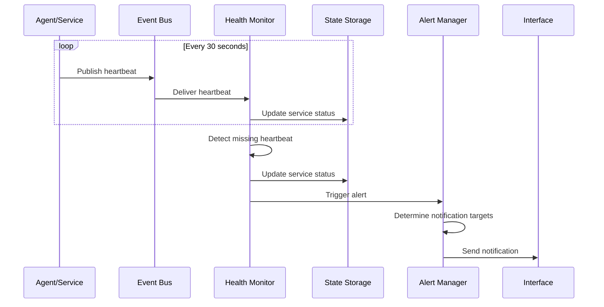

# System Architecture

*Last Updated: 2025-05-10*  
*Owner: Architecture Team*  
*Status: Active*

## Overview

This document provides a comprehensive description of the Alfred Agent Platform v2 system architecture. It covers the platform's core components, interactions, design principles, and implementation details. The architecture is designed to be modular, scalable, and extensible, supporting diverse agent types and workflows across various deployment scenarios.

The Alfred Agent Platform v2 represents a significant evolution from the previous version, with a reimagined architecture that leverages Supabase for state storage and Pub/Sub for messaging. This design enables horizontal scaling, improved reliability, and enhanced flexibility while maintaining backward compatibility with existing agent implementations.

## Architecture Principles

The architecture is guided by the following core principles:

### Scalability

- **Horizontal Scaling**: Components can scale independently based on demand
- **Distributed Processing**: Tasks are distributed across multiple agents and services
- **Stateless Services**: Core services are designed to be stateless for easy scaling
- **Cloud-Native**: Architecture optimized for cloud environments with auto-scaling capabilities

### Modularity

- **Microservices Design**: Independent services with clear boundaries
- **Pluggable Components**: Easily replaceable components with standardized interfaces
- **Separation of Concerns**: Clear separation between processing, storage, and communication
- **Independent Deployment**: Services can be deployed and updated independently

### Flexibility

- **Multi-Agent Support**: Support for diverse agent types and capabilities
- **Transport Layer Abstraction**: Multiple messaging options (Pub/Sub, Supabase Realtime)
- **Storage Abstraction**: Multiple storage options (Supabase, Qdrant, Redis)
- **Multi-Tenant Architecture**: Support for isolated tenant environments

### Observability

- **End-to-End Tracing**: Distributed tracing across all components
- **Comprehensive Metrics**: Performance and health metrics for all services
- **Structured Logging**: Consistent logging format with correlation IDs
- **Health Monitoring**: Regular health checks and status reporting

## High-Level Architecture

The Alfred Agent Platform v2 is organized into the following core layers:

```
┌─────────────────────────────────────────────────────────────┐
│                      Interface Layer                         │
│  (Mission Control UI, Slack Bot, API Gateway, CLI Tools)     │
└───────────────────────────────┬─────────────────────────────┘
                                │
┌───────────────────────────────▼─────────────────────────────┐
│                     Orchestration Layer                      │
│      (Service Registry, Task Orchestrator, Policy Engine)    │
└──────┬─────────────────────┬───────────────────────┬────────┘
       │                     │                       │
┌──────▼─────────┐   ┌──────▼─────────┐    ┌────────▼─────────┐
│  Agent Layer   │   │  Service Layer │    │ Processing Layer │
│ (Domain Agents)│   │(Shared Services)│   │ (Task Processors)│
└──────┬─────────┘   └──────┬─────────┘    └────────┬─────────┘
       │                    │                       │
       └────────────────────┼───────────────────────┘
                            │
┌───────────────────────────▼─────────────────────────────────┐
│                     Foundation Layer                         │
│    (Event Bus, State Storage, Vector Storage, Security)      │
└─────────────────────────────────────────────────────────────┘
```

### Interface Layer

The Interface Layer provides access points to the platform for users and external systems:

- **Mission Control UI**: Web-based dashboard for monitoring and managing the platform
- **Slack Bot (Alfred)**: Conversational interface for user interactions
- **API Gateway**: RESTful API for programmatic access
- **CLI Tools**: Command-line interfaces for development and operations

### Orchestration Layer

The Orchestration Layer coordinates activities across the platform:

- **Service Registry**: Manages service discovery and registration
- **Task Orchestrator**: Coordinates multi-step task workflows
- **Policy Engine**: Enforces access control and business rules

### Agent Layer

The Agent Layer contains the specialized domain agents:

- **Social Intelligence Agent**: Handles social media and trend analysis
- **Legal Compliance Agent**: Manages compliance and regulatory tasks
- **Financial-Tax Agent**: Processes financial and tax-related operations
- **Additional Domain Agents**: Specialized for specific business domains

### Service Layer

The Service Layer provides shared services used by multiple components:

- **Authentication Service**: Manages user and service authentication
- **Analytics Service**: Collects and processes usage analytics
- **Content Service**: Manages content processing and storage
- **Notification Service**: Handles alerting and notifications

### Processing Layer

The Processing Layer handles task execution and processing:

- **LangChain Processors**: Manages LLM-based processing workflows
- **Data Processors**: Handles data transformation and analysis
- **Media Processors**: Processes image, audio, and video content
- **Integration Processors**: Manages external system integrations

### Foundation Layer

The Foundation Layer provides core infrastructure services:

- **Event Bus**: Message transport using Google Cloud Pub/Sub
- **State Storage**: Persistence using Supabase PostgreSQL
- **Vector Storage**: Vector database using Qdrant and pgvector
- **Security Components**: Authentication, authorization, and encryption

## Component Details

### Event Bus (Pub/Sub)

The Event Bus is implemented using Google Cloud Pub/Sub and provides the messaging backbone for the platform:

- **Topics**: Structured as `a2a.[message_type].[optional_subtype]`
- **Subscriptions**: Service-specific with appropriate filtering
- **Delivery**: At-least-once delivery with ordering within region
- **Dead-Letter Handling**: Unprocessable messages sent to dead-letter topics
- **Alternative**: Supabase Realtime for deployments without Pub/Sub

#### Key Topics:

- `a2a.tasks.create`: For initiating tasks
- `a2a.tasks.completed`: For completed task results
- `a2a.events`: For system events
- `a2a.heartbeats`: For service health signals

### State Storage (Supabase)

State Storage is implemented using Supabase's PostgreSQL database:

- **Agent State**: Persistent state for agents and services
- **Task Storage**: Current and historical task information
- **User Data**: User preferences and settings
- **Configuration**: System configuration parameters
- **Vector Support**: pgvector extension for vector operations

#### Key Tables:

- `tasks`: Task definitions and status
- `agent_registry`: Registered agents and capabilities
- `user_preferences`: User-specific settings
- `service_status`: Current service health and status

### Vector Storage (Qdrant)

Vector Storage is provided primarily by Qdrant:

- **Embedding Storage**: Storage for vector embeddings
- **Similarity Search**: Fast nearest-neighbor search
- **Filtering**: Rich filtering capabilities for vector queries
- **Clustering**: Vector clustering for analysis
- **Backup**: pgvector for backup and simpler operations

### Agent Framework

Agents are built on a standardized framework that provides:

- **Lifecycle Management**: Consistent startup, shutdown, and health reporting
- **Event Handling**: Standard patterns for handling messages
- **State Management**: Consistent state persistence and retrieval
- **Observability**: Built-in metrics, tracing, and logging

#### Agent Structure:

```
┌───────────────────────────────────────────┐
│                Agent                       │
│                                           │
│  ┌─────────────┐       ┌──────────────┐   │
│  │ Intent      │       │ State        │   │
│  │ Handlers    │◄─────►│ Manager      │   │
│  └─────────────┘       └──────────────┘   │
│          ▲                    ▲           │
│          │                    │           │
│  ┌──────┴──────┐      ┌──────┴────────┐  │
│  │ Agent       │      │ External      │  │
│  │ Adapter     │◄────►│ Adapters      │  │
│  └─────────────┘      └───────────────┘  │
│          ▲                    ▲           │
│          │                    │           │
└──────────┼────────────────────┼───────────┘
           │                    │
  ┌────────┴────────┐  ┌────────┴────────┐
  │  Event Bus      │  │  External       │
  │  (Pub/Sub)      │  │  Systems        │
  └─────────────────┘  └─────────────────┘
```

### Task Orchestration

Tasks are managed through a dedicated orchestration system:

- **Task Definition**: Structured task definitions with validation
- **Workflow Management**: Multi-step workflow definitions
- **Routing**: Intelligent routing to appropriate agents
- **Monitoring**: Real-time task status monitoring
- **Error Handling**: Standardized error handling and recovery

### Security Architecture

Security is implemented at multiple levels:

- **Authentication**: JWT-based authentication for all services
- **Authorization**: Role-based access control for resources
- **Encryption**: End-to-end encryption for sensitive data
- **Tenancy**: Isolation between tenant environments
- **Audit**: Comprehensive audit logging of all operations

## Data Flow

### Task Creation Flow



### Health Monitoring Flow



## Deployment Architecture

The platform can be deployed in several configurations:

### Local Development

```
┌─────────────────────────────────────────────────┐
│                Docker Compose                    │
│                                                 │
│  ┌──────────┐ ┌──────────┐ ┌─────────────────┐  │
│  │ Supabase │ │ Pub/Sub  │ │ Docker          │  │
│  │ Local    │ │ Emulator │ │ Container Agent │  │
│  └──────────┘ └──────────┘ └─────────────────┘  │
│                                                 │
│  ┌──────────┐ ┌──────────┐ ┌─────────────────┐  │
│  │ Qdrant   │ │ Ollama   │ │ Monitoring      │  │
│  │ Local    │ │ LLM      │ │ Stack           │  │
│  └──────────┘ └──────────┘ └─────────────────┘  │
└─────────────────────────────────────────────────┘
```

### Cloud Deployment

```
┌─────────────────────────────────────────────────┐
│                Google Cloud Platform             │
│                                                 │
│  ┌──────────┐ ┌──────────┐ ┌─────────────────┐  │
│  │ Supabase │ │ Cloud    │ │ Cloud Run       │  │
│  │ Database │ │ Pub/Sub  │ │ Agents          │  │
│  └──────────┘ └──────────┘ └─────────────────┘  │
│                                                 │
│  ┌──────────┐ ┌──────────┐ ┌─────────────────┐  │
│  │ Qdrant   │ │ Cloud    │ │ Cloud           │  │
│  │ Vector DB│ │ Storage  │ │ Monitoring      │  │
│  └──────────┘ └──────────┘ └─────────────────┘  │
└─────────────────────────────────────────────────┘
```

### Hybrid Deployment

```
┌───────────────────────┐ ┌───────────────────────┐
│     Cloud Services    │ │   On-Premise Systems  │
│                       │ │                       │
│  ┌────────┐ ┌───────┐ │ │ ┌───────┐ ┌────────┐ │
│  │Pub/Sub │ │Cloud  │ │ │ │Agent  │ │Internal│ │
│  │        │ │Storage│ │ │ │Services│ │Systems │ │
│  └────────┘ └───────┘ │ │ └───────┘ └────────┘ │
│        ▲        ▲     │ │     ▲         ▲      │
└────────┼────────┼─────┘ └─────┼─────────┼──────┘
         │        │             │         │
         │        │             │         │
┌────────┼────────┼─────────────┼─────────┼──────┐
│        │        │             │         │      │
│    ┌───▼────────▼─────────────▼─────────▼────┐ │
│    │          Secure Gateway / VPN          │ │
│    └────────────────────────────────────────┘ │
│                                               │
└───────────────────────────────────────────────┘
```

## Technology Stack

### Core Infrastructure

- **Containerization**: Docker for container packaging
- **Orchestration**: Docker Compose (dev), Kubernetes (prod)
- **Service Mesh**: Istio for advanced networking (optional)
- **CI/CD**: GitHub Actions for deployment pipelines
- **Monitoring**: Prometheus, Grafana, and OpenTelemetry

### Databases and Storage

- **Relational Database**: Supabase PostgreSQL
- **Vector Database**: Qdrant, pgvector
- **Object Storage**: Cloud Storage / Supabase Storage
- **Caching**: Redis for high-performance caching

### Runtime and Languages

- **Primary Language**: Python 3.11+
- **Secondary Languages**: JavaScript/TypeScript (UI, tools)
- **LLM Framework**: LangChain, LangGraph
- **API Framework**: FastAPI for service endpoints
- **UI Framework**: Next.js for web interfaces

## Scalability and Performance

### Scaling Considerations

The platform is designed to scale in the following ways:

1. **Horizontal Scaling**:
   - Agent instances can be scaled horizontally based on task volume
   - Each service scales independently based on its own resource requirements
   - Event bus and storage components have built-in scaling capabilities

2. **Resource Optimization**:
   - Efficient use of resources through containerization
   - Automatic scaling based on workload
   - Resource limits per component to prevent overallocation

3. **Load Distribution**:
   - Task workloads are evenly distributed across available agent instances
   - Database read operations are distributed across replicas
   - Long-running processes use asynchronous patterns to avoid blocking

### Performance Considerations

Key performance aspects include:

1. **Response Times**:
   - Synchronous operations complete within 200ms
   - Asynchronous tasks acknowledge within 500ms
   - Long-running tasks provide progress updates every 5 seconds

2. **Throughput**:
   - System designed to handle 100+ concurrent tasks
   - Event bus configured for high message throughput
   - Database optimized for concurrent read/write operations

3. **Reliability**:
   - Retry mechanisms for transient failures
   - Circuit breakers to prevent cascading failures
   - Queue-based approach to handle load spikes

## Security Considerations

### Authentication and Authorization

- **User Authentication**: JWT-based authentication via Supabase Auth
- **Service Authentication**: Service accounts with limited permissions
- **Authorization**: Role-based access control (RBAC) for all resources
- **Token Management**: Secure token handling with appropriate lifetimes

### Data Protection

- **Encryption at Rest**: All sensitive data encrypted in storage
- **Encryption in Transit**: TLS for all network communications
- **Sensitive Data Handling**: PII and sensitive data stored with enhanced protection
- **Data Isolation**: Multi-tenant data separated at the database level

### Security Monitoring

- **Access Logging**: Comprehensive logging of all access attempts
- **Intrusion Detection**: Monitoring for unusual access patterns
- **Vulnerability Scanning**: Regular automated security scanning
- **Penetration Testing**: Periodic security testing by specialists

## Disaster Recovery

### Backup Strategy

- **Database Backups**: Hourly incremental, daily full backups
- **Configuration Backups**: Version-controlled configuration with history
- **State Recovery**: Ability to restore from point-in-time backups
- **Backup Verification**: Regular testing of backup restoration

### Recovery Processes

- **Service Restoration**: Automated service restart on failure
- **Data Recovery**: Documented procedures for data restoration
- **Alternative Routing**: Traffic routing around failed components
- **Fallback Modes**: Degraded operation modes when components are unavailable

## Development and Operations

### Development Workflow

- **Environment Parity**: Development environments match production
- **Local Development**: Complete local development setup with containers
- **Testing Framework**: Comprehensive testing at unit, integration, and system levels
- **Documentation**: Inline documentation and dedicated developer guides

### Operational Procedures

- **Deployment**: Automated, versioned deployments with rollback
- **Monitoring**: Real-time monitoring of system health and performance
- **Alerting**: Tiered alerting based on severity and impact
- **Incident Management**: Structured approach to incident handling

## Integration Points

### External Integrations

- **Slack**: Bidirectional integration for user interactions
- **Email Systems**: Notification and report delivery
- **Calendar Systems**: Scheduling and reminder functionality
- **Document Storage**: Integration with document management systems

### API Integrations

- **REST APIs**: Standardized REST APIs for service interactions
- **Webhook Support**: Webhooks for event-based integrations
- **Authentication**: OAuth 2.0 for external service authentication
- **Rate Limiting**: Protection against API abuse

## Future Architecture Evolution

### Planned Enhancements

- **Serverless Components**: Migration of suitable components to serverless
- **Enhanced AI Capabilities**: Integration of additional AI/ML capabilities
- **Advanced Analytics**: Expanded analytics for system optimization
- **Edge Computing**: Moving select processing closer to users

### Architectural Debt Reduction

- **Legacy Component Migration**: Phased migration of legacy components
- **Technical Debt Elimination**: Targeted refactoring of identified issues
- **Standards Alignment**: Alignment with evolving industry standards
- **Documentation Improvement**: Continuous documentation enhancement

## Related Documentation

- [Technical Design Guide](../project/technical-design.md)
- [A2A Protocol Documentation](../api/a2a-protocol.md)
- [Agent Implementation Guide](../agents/guides/agent-implementation-guide.md)
- [Deployment Architecture](../operations/deployment-guide.md)
- [Security Architecture](../architecture/security-architecture.md)

## References

- [Google Cloud Architecture Center](https://cloud.google.com/architecture)
- [Supabase Documentation](https://supabase.io/docs)
- [Pub/Sub Documentation](https://cloud.google.com/pubsub/docs)
- [Qdrant Documentation](https://qdrant.tech/documentation)
- [LangChain Documentation](https://python.langchain.com/docs/get_started/introduction)