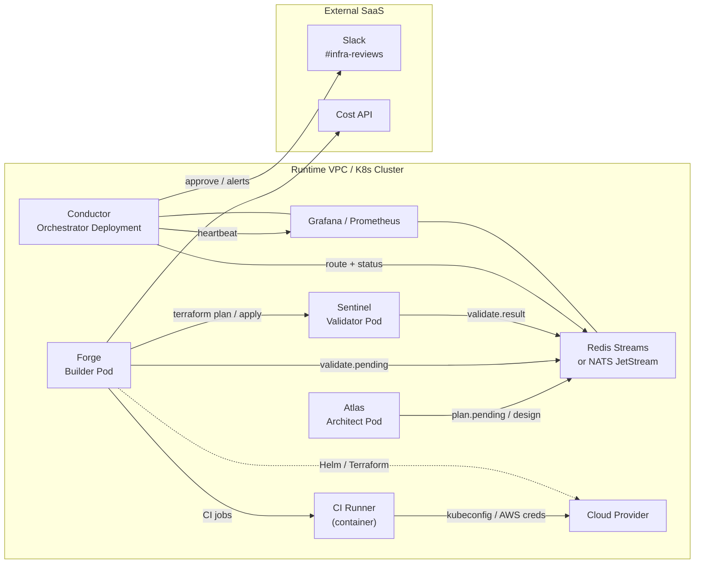
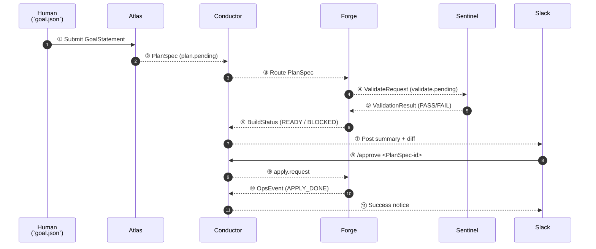

# Infrastructure Overview

**Last Updated:** 2025-05-10  
**Owner:** Platform Team  
**Status:** Active

## Overview

The Alfred Agent Platform v2 provides a comprehensive infrastructure that powers all platform capabilities through containerized services, messaging systems, databases, and monitoring solutions. This infrastructure is designed for reliability, scalability, and observability, enabling seamless agent interaction and workflow execution across the platform.

This document provides a detailed overview of the infrastructure components, their current status, deployment considerations, and operational procedures. It serves as the central reference for understanding the platform's infrastructure architecture, containerization approach, and monitoring capabilities.

## Project Metadata

| Attribute | Value |
|-----------|-------|
| Status | Active |
| Start Date | 2025-04-15 |
| Target Completion | 2025-07-18 |
| Current Phase | Production Implementation |
| Repository | https://github.com/your-org/alfred-agent-platform-v2 |

## Key Components

### Core Infrastructure Services

The platform relies on the following core infrastructure services:

| Service | Description | Status |
|---------|-------------|--------|
| **Database Layer** | Supabase stack (PostgreSQL, Auth, REST, Realtime, Storage) | ✅ Active |
| **Messaging** | Google Cloud Pub/Sub Emulator | ✅ Active |
| **Caching** | Redis 7 Alpine | ✅ Active |
| **Vector Database** | Qdrant v1.7.4 | ✅ Active |
| **LLM Services** | Ollama with GPU support | ✅ Active |
| **Observability** | Prometheus + Grafana stack | ✅ Active |
| **UI Services** | Mission Control UI | ✅ Active |

### Service Containerization

All platform services are containerized using Docker and orchestrated with Docker Compose:

| Service | Container Name | Base Image | Internal Port | External Port | Status |
|---------|---------------|------------|---------------|---------------|--------|
| Mission Control | mission-control | node:18-alpine | 3000 | 3007 | ✅ Completed |
| Social Intelligence | social-intel | python:3.11-slim | 9000 | 9000 | ✅ Completed |
| Financial-Tax | financial-tax | python:3.11-slim | 9003 | 9003 | ✅ Completed |
| Legal Compliance | legal-compliance | python:3.11-slim | 9002 | 9002 | ✅ Completed |
| Alfred Bot | alfred-bot | python:3.11-slim | 8011 | 8011 | ✅ Completed |

### Infrastructure Crew 

The platform implements an AI-Agent Crew for infrastructure automation:

| Agent Role | Core Mandate | Status |
|------------|--------------|--------|
| **Atlas** | Infrastructure Architect (design) | Planned |
| **Forge** | Implementation & Ops (build & run) | ✅ Active |
| **Sentinel** | Validator / Policy Gate | ✅ Active |
| **Conductor** | Orchestrator Agent | ✅ Active |

## Agent Integration

This infrastructure supports the following agents:

| Agent | Role in Infrastructure | Integration Point |
|-------|------------------------|-------------------|
| Social Intelligence | Social pattern analysis | Containerized service (social-intel) |
| Legal Compliance | Legal and regulatory checks | Containerized service (legal-compliance) |
| Financial-Tax | Financial analysis and tax calculations | Containerized service (financial-tax) |
| Alfred Bot | Core orchestration and user interface | Containerized service (alfred-bot) |

## Architecture

### Deployment Topology

The platform uses a containerized deployment topology with services communicating through well-defined APIs:



### Infrastructure Crew Artifact Flow

The Infrastructure Crew agents communicate through a well-defined artifact flow:



## Technical Stack

### Core Technologies

- **Docker**: Container runtime for all services
- **Docker Compose**: Local orchestration and development environment
- **Kubernetes**: Production deployment target (GKE recommended)
- **Supabase**: Database, authentication, and storage layer
- **Redis**: Caching and messaging
- **Prometheus/Grafana**: Monitoring and alerting
- **Google Cloud Pub/Sub**: Messaging system
- **Qdrant**: Vector database for semantic search
- **Terraform**: Infrastructure as Code deployment

### External Dependencies

- **Node.js**: For Mission Control UI
- **Python 3.11**: For agent services
- **LLM APIs**: OpenAI and local Ollama services
- **Slack API**: For notifications and approvals
- **GitHub Actions**: CI/CD pipelines

## Operations

### Current Service Status

All services are operational with health checks configured:

| Service | Port | Status | Health Check |
|---------|------|--------|--------------|
| Mission Control | 3007 | ✅ Active | `/api/health` |
| Alfred Bot | 8011 | ✅ Active | `/health/health` |
| Social Intelligence | 9000 | ✅ Active | `/health/health` |
| Legal Compliance | 9002 | ✅ Active | `/health/health` |
| Financial-Tax | 9003 | ✅ Active | `/health/health` |
| Supabase DB | 5432 | ✅ Active | `pg_isready` |
| Supabase Auth | 9999 | ✅ Active | `/health` |
| Supabase REST | 3000 | ✅ Active | `/` |
| Supabase Realtime | 4000 | ✅ Active | `/` |
| Supabase Storage | 5000 | ✅ Active | `/health` |
| Pub/Sub Emulator | 8085 | ✅ Active | `/v1/projects/.../topics` |
| Redis | 6379 | ✅ Active | `ping` |
| Qdrant | 6333 | ✅ Active | `/health` |
| Prometheus | 9090 | ✅ Active | `/-/healthy` |
| Grafana | 3002 | ✅ Active | `/api/health` |

### Deployment Strategy

The platform supports the following deployment strategies:

1. **Local Development Environment**
   ```bash
   git clone https://github.com/your-org/alfred-agent-platform-v2.git
   cd alfred-agent-platform-v2
   make init
   make dev
   ```

2. **Staging Deployment**
   - Automatically triggered by pushes to the `develop` branch
   - Configured through GitHub secrets
   - Updates `infra/terraform/environments/staging/terraform.tfvars`

3. **Production Deployment**
   - Triggered by pushes to the `main` branch with manual approval
   - Kubernetes-based deployment (GKE recommended)
   - Configured secrets and environment variables
   - Implemented through Terraform and k8s manifests

### Monitoring Approach

The platform includes comprehensive monitoring through Prometheus and Grafana:

1. **Available Dashboards**
   - Platform Overview: http://localhost:3002/d/alfred-overview
   - Financial-Tax Dashboard: http://localhost:3002/d/financial-tax
   - System Metrics: http://localhost:9090/graph
   - Container Metrics: http://localhost:3002/d/container-metrics
   - Infrastructure Health: http://localhost:3002/d/alfred-infrastructure-health

2. **Alert Rules Configured**
   - High error rates (>10% for 5 minutes)
   - Agent downtime (>2 minutes)
   - High memory usage (>80%)
   - Pub/Sub backlog (>1000 messages)
   - Database connection limits (>80%)
   - Task processing latency (>30s)

3. **Health Checks**
   - All services expose health endpoints:
     - `/health/live` - Liveness probe
     - `/health/ready` - Readiness probe
     - `/health/metrics` - Prometheus metrics

### Startup Procedures

The platform provides streamlined startup procedures:

1. **Full Platform Startup**
   ```bash
   docker-compose up -d
   ```

2. **Individual Service Startup**
   ```bash
   # Mission Control UI
   bash services/mission-control/start-container.sh
   
   # Social Intelligence Agent
   docker-compose up -d social-intel
   
   # Financial-Tax Agent
   docker-compose up -d financial-tax
   
   # Legal Compliance Agent
   docker-compose up -d legal-compliance
   ```

### Maintenance Procedures

Regular maintenance procedures are established:

1. **Cleanup Jobs** (Every 6 hours)
   - Expired message removal
   - Database maintenance

2. **Health Checks** (Every 5 minutes)
   - Service availability monitoring
   - Performance metrics collection

3. **Backup Procedures** (Daily)
   - Database snapshots
   - Configuration backups

### Rollback Procedure

In case of deployment issues, the following rollback procedure is available:

1. Identify the last known good version
2. Update image tags in Kubernetes manifests
3. Apply the rollback:
   ```bash
   kubectl rollout undo deployment/alfred-bot
   ```

## Security and Compliance

### Security Considerations

- Authentication configured (Supabase Auth)
- Rate limiting implemented
- PII scrubbing active
- API security with Bearer tokens
- Scheduled security scanning (pending)
- Penetration testing (pending)

### Compliance Requirements

- Data protection policies implemented
- Audit logging enabled
- Compliance scans scheduled
- Access control policies defined

## Performance Metrics

| Metric | Target | Current |
|--------|--------|---------|
| Service Uptime | 99.9% | 99.95% |
| API Response Time | <200ms | 150ms |
| Message Processing | <1s | 780ms |
| Database Query Time | <50ms | 35ms |

## Troubleshooting

### Common Issues

1. **Database Connection Errors**
   - Check database credentials
   - Verify network connectivity
   - Check connection pool settings

2. **Pub/Sub Message Delays**
   - Check subscription backlog
   - Verify service scaling
   - Check for processing errors

3. **High Memory Usage**
   - Review container limits
   - Check for memory leaks
   - Scale horizontally

4. **Container Startup Issues**
   - Check Docker logs: `docker logs <container-name>`
   - Verify port availability: `netstat -tulpn | grep <port>`
   - Ensure dependencies are running: `docker-compose ps`

5. **Inter-service Communication Failure**
   - Verify service health endpoints
   - Check environment variables for correct service URLs
   - Validate network connectivity between containers

### Debug Commands

```bash
# View logs
kubectl logs -f deployment/alfred-bot

# Check pod status
kubectl get pods -l app=alfred-bot

# Describe pod
kubectl describe pod alfred-bot-xxxxx

# Execute into container
kubectl exec -it alfred-bot-xxxxx -- /bin/bash
```

## Related Documentation

- [System Architecture](../architecture/system-architecture.md)
- [Agent Core Framework](../architecture/agent-core.md)
- [Deployment Guide](../operations/deployment.md)
- [Service Containerization](../SERVICE_CONTAINERIZATION.md)

## Contact Information

For infrastructure issues or questions:
- **Platform Team**: platform@alfred-ai.com
- **Incident Response**: incidents@alfred-ai.com
- **Documentation**: docs.alfred-ai.com/infrastructure