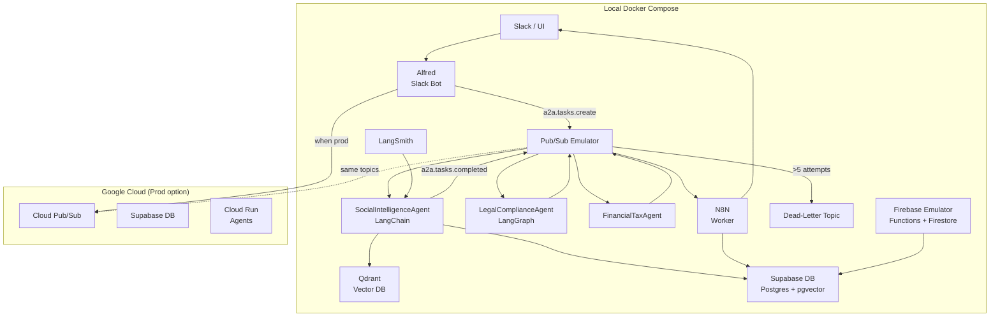

# AI Agent Platform v2 - Technical Design Guide

**Last Updated:** 2025-05-10  
**Owner:** Platform Engineering Team  
**Status:** Active  
**Related Project:** [Master Plan](./master-plan.md)

## Overview

This document serves as a comprehensive technical design guide for the Alfred Agent Platform v2. The platform leverages Supabase for state storage and Pub/Sub for messaging, ensuring scalability, flexibility, and future-proofing. The system is designed to be modular, event-driven, and capable of scaling horizontally across multiple agents, services, and data layers.

## Project Metadata

| Attribute | Value |
|-----------|-------|
| Status | Active |
| Start Date | 2025-01-01 |
| Target Completion | 2025-06-30 |
| Current Phase | Financial-Tax Agent Implementation |
| Repository | [alfred-agent-platform-v2](https://github.com/company/alfred-agent-platform-v2) |

## High-Level System Design

### Key Design Principles

#### Scalability

- **Horizontal Scalability**: The system scales across multiple containers or nodes, ensuring that services such as agents, state stores, and messaging brokers can expand as task volume increases.
- **Distributed Systems**: Designed to handle distributed workloads with independent scaling for each component (agents, database, Pub/Sub).
- **Cloud-Native**: Leverages cloud-native tools (Google Cloud Run, AWS Lambda, Kubernetes) to auto-scale and optimize cloud usage.

#### Modularity

- **Loose Coupling**: Components such as agents, databases, and messaging layers communicate via standardized envelopes (A2A schema). This decouples components, allowing them to evolve independently.
- **Microservices**: The system is designed with independent services (agents, databases, task processing) so that each can scale and evolve without causing disruptions to others.

#### Flexibility & Extensibility

- **Open Standards**: Adheres to open standards and protocols (A2A envelope schema, JSON), making the system easily extensible and adaptable to new technologies.
- **Pluggable Agents**: Agents are replaceable or extendable with minimal disruption, following a standard interface for communication (via Pub/Sub).

#### Security & Privacy

- **Role-Based Access Control (RBAC)**: Implements RBAC for controlling access to tasks and sensitive data.
- **Data Encryption**: Ensures data encryption in transit (TLS/SSL) and at rest, particularly for sensitive user or task data.
- **Audit & Compliance**: Maintains an audit trail of agent actions and task processing to comply with data protection regulations like GDPR.

#### Observability & Monitoring

- **End-to-End Tracing**: Implements distributed tracing across tasks, agents, and services using OpenTelemetry or Jaeger.
- **Metrics & Alerts**: Set up custom monitoring and alerting with Prometheus, Grafana, and Google Cloud Monitoring to ensure task success, system performance, and error handling.

## Core Components and Technologies

### Transport Layer (Pub/Sub)

- **Google Cloud Pub/Sub** remains the primary messaging layer for inter-agent communication, providing exactly-once semantics.
- **Task Communication**: Agents communicate through two main topics:
  - `a2a.tasks.create` (for task initiation)
  - `a2a.tasks.completed` (for task completion)
- **Broker Independence**: While Pub/Sub is the primary broker, the platform supports alternative transport layers (e.g., Supabase Realtime, Redis Streams) via modular adapters.

### Service Discovery

- Agents register their card at startup to the agent_registry table
- Service discovery queries Supabase for active agents
- Registry updates on health check failures
- Agents cache registry locally with 60s TTL

### State & Task Storage (Supabase)

- **Supabase** replaces Firestore for state storage. It uses Postgres with the pgvector extension for vector-based storage, ensuring that the platform has both SQL capabilities and vector support in one place.
- **Task State Storage**: Tasks are stored in Postgres using structured tables. Supabase's real-time capabilities push updates to clients (like the Mission Control UI).
- **Vector Store**: pgvector is used for storing and querying vector embeddings, enabling efficient semantic searches.

### Vector Storage (Qdrant)

- **Qdrant** continues to be used for vector search because it provides optimizations like HNSW (Hierarchical Navigable Small World) for fast nearest-neighbor search. Supabase's pgvector may not perform as well for large-scale vector searches.

### AI Agent Framework (LangChain & LangGraph)

- **LangChain** orchestrates task workflows by chaining multiple LLM calls and integrating external APIs. It provides a simple interface to manage complex decision-making logic in agents.
- **LangGraph** is used for clustering, reasoning, and advanced data relationship mapping, especially for agents like SocialIntelligence and LegalCompliance.

### Observability & Monitoring

- **LangSmith** is used to test, monitor, and debug agent workflows. It integrates directly with LangChain and helps ensure that task envelopes are processed correctly.
- **Prometheus** and **Grafana** handle system metrics, while **OpenTelemetry** is used for tracing and monitoring task performance across distributed agents.

## Detailed Architecture

### Agent Workflow

1. **Task Creation**: When a task is triggered (via Slack bot or other sources), the entry agent (e.g., Alfred) publishes a message to the `a2a.tasks.create` topic.
2. **Task Processing**:
   - The agent responsible for the task subscribes to the task creation message, processes the task, and possibly calls other agents or external APIs as part of the task workflow.
   - Agents use LangChain to orchestrate workflows (e.g., invoking LangGraph for reasoning or clustering data).
3. **Task Completion**: Once the agent completes its task, it publishes the `a2a.tasks.completed` message, containing the results of the task and any follow-up actions needed.
4. **State Storage**: The task's status and data are saved in Supabase Postgres. Vectors or embeddings related to the task are stored in Qdrant or pgvector for fast search.

### Data Flow Diagram



## System Implementation

### Setup Supabase

1. **Install Supabase** with Docker Compose:
   ```yaml
   services:
     supabase-db:
       image: supabase/postgres:16
     supabase-rest:
       image: supabase/postgrest
     supabase-realtime:
       image: supabase/realtime
   ```

2. **Configure pgvector**: Install `pgvector` to support vector storage:
   ```sql
   CREATE EXTENSION IF NOT EXISTS pgvector;
   ```

### Code Changes

1. **State Store Migration**: Replace Firestore client with Postgres using `asyncpg`:
   ```python
   import asyncpg
   conn = await asyncpg.connect("postgres://supabase_user@supabase:5432/postgres")
   await conn.execute("INSERT INTO tasks ...")
   ```

2. **Integrate LangChain**: Orchestrate agent workflows with LangChain.
   - Use LangChain's AgentExecutor to define and execute task chains.
   
3. **Real-Time Updates**: For live updates, integrate Supabase Realtime via WebSockets in the UI.

## Future-Proofing Considerations

### Multi-Cloud & Hybrid Architecture

- Design the platform to be cloud-agnostic, enabling deployment across AWS, GCP, or hybrid environments.
- **Serverless Options**: Use serverless computing (e.g., AWS Lambda, Cloud Run) for stateless components (e.g., task processing agents).

### Agent Extensibility

- Use plug-and-play agent design so that new agents can be added with minimal changes to existing infrastructure. Each agent follows the A2A schema to ensure consistent communication and interoperability.

### Open Standards for Communication

- Adhere to open data formats (e.g., JSON) and protocols for agent interaction to make it easier to integrate with third-party services or tools.

## Implementation Status

The implementation of the technical design follows the phases outlined in the [Master Plan](./master-plan.md):

### Completed Components

- **Core Infrastructure**: Supabase, Pub/Sub Emulator, Qdrant, and Observability stack are fully operational
- **Core Libraries**: A2A Adapter Library, Agent Core Library, and Observability Library
- **Initial Services**: Alfred Bot Service, Social Intelligence Agent, and Legal Compliance Agent
- **Development Environment**: Docker Compose configuration, CI/CD pipeline, and VS Code setup

### In Progress

- **Financial-Tax Agent**: Currently implementing the core financial analysis chains and tax compliance verification system
- **Integration Testing**: Verifying message flow and database schema compatibility across agents

### Upcoming Work

- **Mission Control UI**: Dashboard for monitoring agent health and system performance
- **Infrastructure as Code**: Terraform configurations for production deployment
- **Enhanced Monitoring**: Advanced observability with detailed metrics and alerting
- **E2E Testing**: Comprehensive testing across the entire platform

## Next Steps and Engineering Tasks

1. **Complete Financial-Tax Agent**: Finish implementation and integration with existing agents
2. **Develop Mission Control UI**: Set up Next.js project and create real-time monitoring components
3. **Cloud Deployment**: Prepare Terraform configurations for production environment
4. **Advanced Monitoring**: Set up additional Grafana dashboards and alerting rules
5. **E2E Testing**: Create comprehensive test scenarios and performance benchmarks

## Conclusion

This design guides the transformation of the Alfred Agent Platform into a modular, scalable, and future-proof system. By using Supabase for state storage and maintaining Pub/Sub for messaging, we ensure a reliable foundation for building intelligent agents capable of handling complex workflows. The platform's modularity and scalability allow for easy integration with new technologies as the system evolves.

## Related Documentation

- [Master Plan](./master-plan.md)
- [System Architecture](../architecture/system-design.md)
- [API Documentation](../api/a2a-protocol.md)
- [Social Intelligence Agent](../agents/domain/social-intelligence.md)
- [Legal Compliance Agent](../agents/domain/legal-compliance.md)
- [Alfred Bot Implementation](../alfred_assistant_implementation/implementation-plan.md)