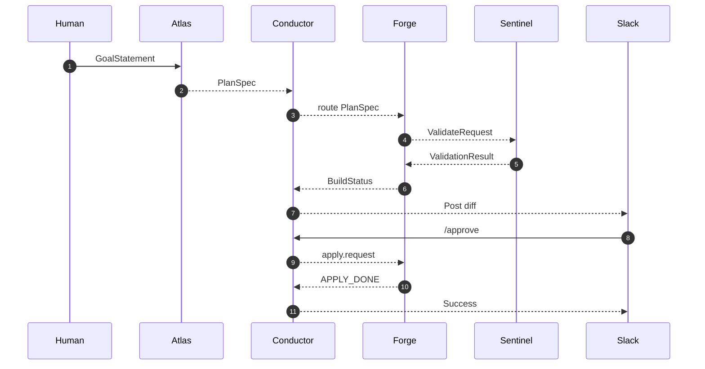
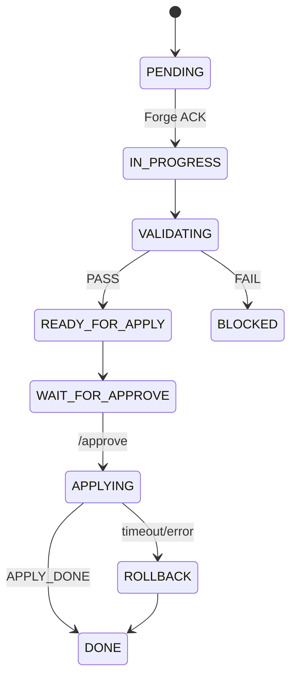
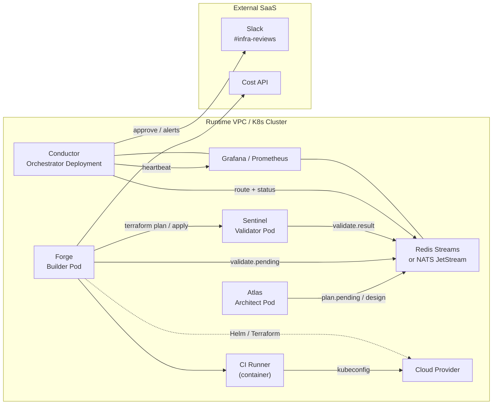

# Infra_Architect_Lean_Crew_MVP

# 🏗️ Autonomous Infra Platform – Lean-Crew MVP (v0.1)

> Purpose
> 
> 
> Establish a minimal yet production‑ready agent crew capable of designing, building, validating, and deploying cloud infrastructure for a single user or service—while leaving clear seams for future agents and scale‑out.
> 

---

## 1 High‑Level Vision

1. **Typed‑artifact contracts** (JSON) over a message bus (Redis Streams / NATS) decouple every agent.
2. **Human `/approve`** gate provides governance without blocking day‑to‑day automation.
3. **Incremental roster** – Lean → Growth → Large‑Scale. Add agents without breaking contracts.

---

## 2 Agent Roster Overview

| Stage | Handle & Role | Core Mandate | Typical Trigger | Key Tools |
| --- | --- | --- | --- | --- |
| **Lean Crew (Day 1)** |  |  |  |  |
| ① | **Atlas** – *Infrastructure Architect* | Produce PlanSpec, cost/perf budgets, diagrams. | GoalStatement, capacity spike | RAG, Mermaid, Infracost |
| ② | **Forge** – *Builder & Ops* | Convert PlanSpec → IaC, run deploy, emit OpsEvents. | `plan.pending`, alert, drift check | Terraform, Helm, k6 |
| ③ | **Sentinel** – *Validator* | Static analysis, OPA/cost checks → PASS / FAIL. | `validate.pending`, nightly scan | tfsec, Conftest, Infracost |
| ④ | **Conductor** – *Orchestrator* | Route artifacts, maintain state‑machine, heartbeats. | Any artifact | Redis Streams, LangGraph |
| **Growth Crew (30‑90 d)** |  |  |  |  |
| ⑤ | **FinPilot** – FinOps Optimiser | Spend vs. budget analysis, rightsizing PRs. | Daily cost feed | Billing APIs, anomaly models |
| ⑥ | **Shield** – SecOps / Compliance | CVE feed monitor, auto‑patch, quarantine. | CVE publish, failed scan | trivy, Inspector, OPA |
| ⑦ | **Observer** – Telemetry & SLO | Dashboards, alerts, auto‑scale hooks. | Metric breach | Prometheus, Grafana |
| ⑧ | **Chaosmith** – Resilience Tester | Fault injection, chaos certification. | Weekly chaos window | ChaosMesh, Litmus |
| **Large‑Scale Crew (180 d+)** |  |  |  |  |
| ⑨ | **DataSteward** – Data Ops | Schema migrations, backups, GDPR compliance. | New DB PlanSpec | Flyway, snapshot APIs |
| ⑩ | **Synthesist** – Knowledge Manager | Curate vector store of runbooks & RCAs. | New artifact | pgvector, semantic search |
| ⑪ | **Incident Commander** – AIOps | Multi‑signal alert correlation, RCA summaries. | Sev‑1 burst | Event‑correlation ML |
| ⑫ | **Provisioner** – Fleet Manager | Cluster capacity & hardware lifecycle. | Scaling trend | Autoscaler, inventory DB |

---

## 3 Atlas – Full Role Blueprint

| Category | Details |
| --- | --- |
| **Mission** | Design, govern, and iteratively optimise all infrastructure layers through policy‑driven architecture. |
| **Scope of Authority** | Can draft designs, cost reports, and rollback suggestions; cannot merge or apply without Sentinel + human approval. |
| **Primary Inputs** | GoalStatement JSON, OrgPolicy embeddings, telemetry feedback. |
| **Outputs** | PlanSpec JSON, SVG/Mermaid diagrams, cost/risk report, improvement tickets. |
| **Core Capabilities** | Diagram synthesis, budget simulation, policy constraint parsing. |
| **Reasoning Skillset** | Trade‑off analysis, failure‑impact projection, refactor scoring. |
| **Tool Access** | Diagram APIs, Terraform registry, cost calculator APIs. |
| **Memory & Recall** | pgvector (runbooks, past PlanSpecs), Redis Streams (ephemeral), Postgres (audit). |
| **Failure Handling** | Emits `DesignBlocked` with rationale if constraints clash; escalates to human after two retries. |
| **Validation Checkpoints** | Requires Sentinel static validation + human `/approve`. |
| **KPIs** | ≥95 % PlanSpec‑to‑code success, ≤2 % infra error rate, ≥10 % yearly cost savings from suggestions. |
| **Maturity Levels** | Pilot → Reliable → Autonomous → Advisor |

---

## 4 Execution Sequence ⏱️ (Merge Gates)

| Step | Deliverable | Effort (hrs) |
| --- | --- | --- |
| 0 | `artifact‑schema‑v0.1/`, Conductor state‑diagram, repo scaffold | 4 |
| 1 | Redis/NATS stack + *Conductor‑light* + fixture test | 8 |
| 2 | **Atlas v0** – CLI `atlas plan goal.json` → PlanSpec | 12 |
| 3 | **Forge v0** – Terraform dry‑run, emit ValidateRequest | 16 |
| 4 | **Sentinel v0** – tfsec + Infracost PASS/FAIL | 8 |
| 5 | Slack `/approve` + `/rollback` & rollback SLA (5 + 15 min) | 6 |
| 6 | Grafana board: queue depth, heartbeat, token burn | 4 |
| 7 | Hard budget brake (80 % forecast) | 3 |

**Total ≈ 61 hrs** → one‑person MVP in ~10 focused days.

---

## 5 Gaps & Mitigations

| Gap | Mitigation |
| --- | --- |
| JSON schemas undefined | Ship `PlanSpec`, `ValidationReport`, etc. with JSON‑Schema + CI validation. |
| Retry semantics fuzzy | Conductor state‑machine (see diagram). |
| No observability baseline | Minimal Grafana + alert. |
| Runtime CVE scan deferred | Shield‑Lite RSS forwarder. |
| Rollback SLA undocumented | Hard‑code: *begin < 5 min, finish < 15 min*. |

---

## 6 Diagrams

### 6.1 Lean‑Crew Artifact Flow



### 6.2 Conductor State Machine



### 6.3 Deployment Topology



---

## 7 CI Workflow – Auto‑build Diagrams

- .github/workflows/diagram-autogen.yml
    
    ```yaml
    name: Build & Commit Diagramson:  push:    paths:      - 'docs/diagrams/src/**/*.mmd'      - '.github/workflows/diagram-autogen.yml'  workflow_dispatch:jobs:  render-mermaid:    runs-on: ubuntu-latest    steps:      - uses: actions/checkout@v4        with: {fetch-depth: 0}      - uses: actions/setup-node@v4        with: {node-version: '20'}      - run: npm install -g @mermaid-js/mermaid-cli@10      - name: Lint diagrams        run: |          shopt -s globstar
              for f in docs/diagrams/src/**/*.mmd; do
                mmdc -i "$f" -o /dev/null --quiet
              done
          - name: Render SVGs        run: |          shopt -s globstar
              mkdir -p docs/diagrams/svg
              for f in docs/diagrams/src/**/*.mmd; do
                b=$(basename "$f" .mmd)
                mmdc -i "$f" -o "docs/diagrams/svg/$b.svg"
              done
          - uses: stefanzweifel/git-auto-commit-action@v5        with:          commit_message: "docs(diagrams): auto-update SVGs"          branch: ${{ github.head_ref }}          commit_user_name: diagram-bot          commit_user_email: bot@example.com
    ```
    

---

## 8 Next Approval Checklist ✅

1. **Lock `artifact‑schema‑v0.1`** fields.
2. **Sign‑off rollback SLA + budget cap (80 %).**
3. **Green‑light execution timeline (61 hrs).**
4. **Accept diagrams + CI workflow.**