# Infrastructure Crew

### **1 ️⃣ Lean-Crew Artifact Flow**

*(high-level “happy path” from design to approval)*

```mermaid
sequenceDiagram
    autonumber
    participant User as Human<br/>(`goal.json`)
    participant Atlas
    participant Conductor
    participant Forge
    participant Sentinel
    participant Slack as Slack<br/>#infra-reviews

    User->>Atlas: ① Submit GoalStatement
    Atlas-->>Conductor: ② PlanSpec (plan.pending)
    Conductor-->>Forge: ③ Route PlanSpec
    Forge-->>Sentinel: ④ ValidateRequest (validate.pending)
    Sentinel-->>Forge: ⑤ ValidationResult (PASS/FAIL)
    Forge-->>Conductor: ⑥ BuildStatus (READY / BLOCKED)
    Conductor-->>Slack: ⑦ Post summary + diff
    Slack->>Conductor: ⑧ /approve <PlanSpec-id>
    Conductor-->>Forge: ⑨ apply.request
    Forge-->>Conductor: ⑩ OpsEvent (APPLY_DONE)
    Conductor-->>Slack: ⑪ Success notice
```



Legend:

| **Stream** | **Redis/NATS Topic** |
| --- | --- |
| plan.pending | new designs waiting for build |
| validate.pending / result | validation hand-shake |
| apply.request / event | deployment stage |
| conductor.health | heartbeat |

### **2 ️⃣ Conductor State Machine**

*(internal status table per PlanSpec-ID)*


**Timeout / Error Guards:**

| **Transition** | **Auto-trigger** |
| --- | --- |
| IN_PROGRESS → BLOCKED | Forge no heartbeat > 5 min |
| VALIDATING → BLOCKED | Sentinel timeout > 5 min |
| APPLYING → ROLLBACK | Apply exceeds 15 min SLA |
|  |  |

**3  ️⃣ Deployment-Topology (copy-paste into any Mermaid viewer)**


**Reading tips**

- **Left box** = everything inside your Kubernetes or Docker-Compose stack.
- **Redis Streams / NATS** = single message bus—agents publish/subscribe JSON artifacts.
- **Forge → CI Runner** = same image can run locally or in GitHub Actions; only difference is credential injection.
- **Grafana/Prometheus** = can run side-car in the cluster or as SaaS (Grafana Cloud).
- Use*["Label<br/>Line2"]for multiline node names and| label |for edge text.*
- Avoid double parentheses like*[(…))]—single parentheses are sufficient.*

**4 ️⃣ GitHub Actions workflow — auto-build diagrams**

> Assumptions
> 
- Mermaid source files live in docs/diagrams/src/*.mmd.
- Generated SVGs go to docs/diagrams/svg/.
- You have write permission to push back to the branch (or you can switch the final step to upload artifacts instead of committing).

```mermaid
# .github/workflows/diagram-autogen.yml
name: Build & Commit Diagrams

on:
  push:
    paths:
      - 'docs/diagrams/src/**/*.mmd'
      - '.github/workflows/diagram-autogen.yml'
  workflow_dispatch:

jobs:
  render-mermaid:
    runs-on: ubuntu-latest
    steps:
      - name: 🚚 Checkout
        uses: actions/checkout@v4
        with:
          fetch-depth: 0   # needed if you commit back

      - name: 🔧 Set up Node + mermaid-cli
        uses: actions/setup-node@v4
        with:
          node-version: '20'
      - run: |
          npm install -g @mermaid-js/mermaid-cli@10
          mkdir -p docs/diagrams/svg

      - name: 🖼️ Render all .mmd to .svg
        run: |
          for file in docs/diagrams/src/**/*.mmd; do
            base=$(basename "$file" .mmd)
            mmdc -i "$file" -o "docs/diagrams/svg/${base}.svg"
          done

      # OPTIONAL: generate PNGs too
      # - name: Render PNGs
      #   run: |
      #     for file in docs/diagrams/src/**/*.mmd; do
      #       base=$(basename "$file" .mmd)
      #       mmdc -i "$file" -o "docs/diagrams/svg/${base}.png" -b transparent
      #     done

      - name: 🚀 Commit & push diagrams
        uses: stefanzweifel/git-auto-commit-action@v5
        with:
          commit_message: "docs(diagrams): auto-update generated SVGs"
          branch: ${{ github.head_ref }}
          commit_user_name: diagram-bot
          commit_user_email: bot@example.com
```

**If you can’t push back (e.g., on PRs from forks)**
Replace the last step with an artifact upload:

```yaml
  - uses: actions/upload-artifact@v4
    with:
      name: rendered-diagrams
      path: docs/diagrams/svg/

```

*Those artifacts then show up in the “Actions” tab for download or further pipeline steps.*

**Where to drop these files**

repo-root/
├─ docs/
│  └─ diagrams/
│      ├─ src/
│      │   ├─ lean-crew-flow.mmd
│      │   └─ conductor-sm.mmd
│      └─ svg/
├─ .github/
│  └─ workflows/
│      └─ diagram-autogen.yml

With these pieces in place you get:

- **Living diagrams** that always reflect the latest .mmd edits.
- **Zero manual exports**—CI handles SVG generation.
- **Deployment topology clarity** for new contributors or reviewer audits.

Let me know if you’d like:

- a **Makefile** alternative for local generation,
- **Docker-Compose** entry to bundle mermaid-cli, or
- any tweaks to labels/links in the topology.

### **How to Use**

1. **Copy** each diagram into any Mermaid-enabled editor to render.
2. **Embed** directly in Markdown docs or PR descriptions for living documentation.
3. **Extend** topics/states as new agents arrive (FinPilot, Shield, etc.)—the artifact bus stays unchanged.
4. **CI to catch Mermaid errors**
    1. Add a quick **Mermaid syntax-lint** step before rendering:

```yaml
- name: 🕵️ Syntax check
  run: |
    npm install -g @mermaid-js/mermaid-cli@10
    for file in docs/diagrams/src/**/*.mmd; do
      mmdc -i "$file" -o /dev/null --quiet
    done
```

The --quiet flag suppresses SVG output; the command exits non-zero on parse errors, so your build fails early.