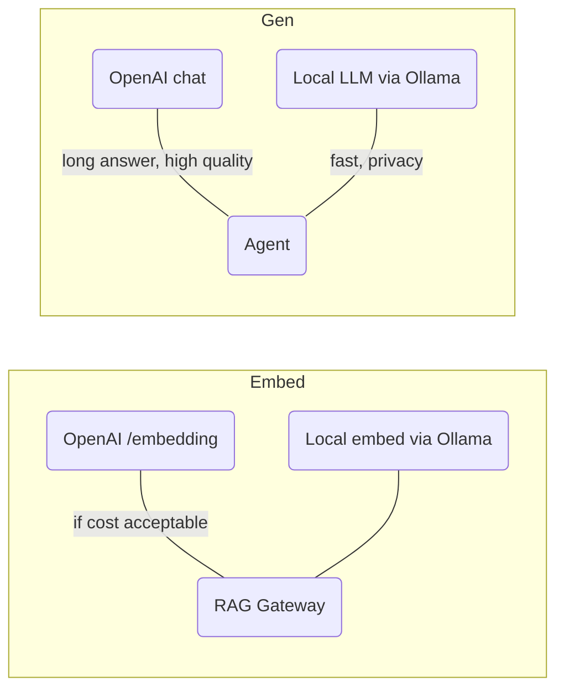

# RAG Service – Architectural RFC

# RAG Service – Architectural RFC

## 1. Metadata

| Key | Value |
| --- | --- |
| **Status** | Draft |
| **Authors** | Platform Architecture Guild (initial author: *<your‑name>*) |
| **Created** | 2025‑05‑09 |
| **Target Iteration** | Weeks 0‑2 (see rollout plan) |
| **Reviewers** | Infra Crew Leads, Synthesist Owner, Security Lead |
| **Supersedes / Depends on** | None (first edition) |

## 2. Context & Problem Statement

Our multi‑agent platform already embeds LangChain/LangGraph tooling and maintains two separate vector stores (Qdrant and pgvector). Retrieval‑Augmented Generation (RAG) is currently siloed to individual agents (e.g., **Atlas**) and lacks cross‑agent memory, standardized schemas, and observability. We need a **shared, opinionated RAG Service** that any agent or external service can invoke while meeting enterprise‑grade scalability, security, and governance requirements.

### Symptoms

- Duplicate embeddings across Qdrant & Supabase pgvector.
- Inconsistent retrieval quality; no platform metrics (hit‑rate, latency).
- Manual boiler‑plate in each agent for embedding & querying.
- Lack of row‑level security guarantees in Qdrant.

### Requirements Summary

1. **Canonical store** with multi‑tenant isolation.
2. **Unified API** (gRPC + REST) for embed/index/query/chat.
3. **Streaming & batch ingestion** triggered by message‑bus events.
4. **Governed schemas & traceability** for retrieval requests/responses.
5. **Observability KPIs** (precision, latency, token usage).
6. **Extensible** for hybrid search, re‑ranking, feedback loop.

## 3. Goals & Non‑Goals

| Goals | Non‑Goals |
| --- | --- |
| Replace per‑agent retrieval with a shared service. | Replace every existing storage system (pgvector still useful for metadata). |
| Guarantee tenant isolation and row‑level security. | Provide a UI search console (may come later via Synthesist). |
| Provide measurable retrieval quality metrics. | Replace event bus or auth provider. |
| Plug seamlessly into LangChain/LlamaIndex. | Choose the *final* embedding model for all time. |

## 4. Architectural Overview

```
┌──────────────┐  REST/gRPC  ┌──────────────┐
│  Agent A …   │◀───────────▶│  RAG Gateway │
└──────────────┘             └──────┬───────┘
                                     │JWT + tenant
                                     ▼
                       ┌────────────────────────┐
                       │  Qdrant Cluster (prod) │
                       └────────────────────────┘
                                     ▲
                        batch / stream writers
                                     ▲
                ┌─────────────────────┴─────────────────────┐
                │ Ingestion Workers (LangChain pipelines)   │
                └─────────────────────┬─────────────────────┘
              S3, Git, Confluence …   │     bus: doc.ingest.*
                                       ▼
                                  Redis / NATS

```

## 4.1 Deployment Mode – Local / On‑Prem (Solo‑Builder)

> Baseline : Qdrant, Supabase‑Auth, Supabase‑DB, Prometheus, and Grafana are already running on the host. One RTX 3080 Ti (12 GB VRAM) is available; Ollama serves localhost REST endpoints for quantised LLMs. OpenAI APIs remain reachable for higher‑quality tasks when latency or cost allows.
> 

| Area | Local Component | Configuration Notes |
| --- | --- | --- |
| **Auth** | Supabase Auth + Postgres | Already deployed; JWT issuer reachable at `http://auth.internal:3000`. |
| **LLM Serving** | **Ollama** (`ollama serve`) | Models pulled via `ollama pull llama3:8b-q4`, `ollama pull nomic-embed:text` etc.; listens on `127.0.0.1:11434`. |
| **Embedding Worker** | Docker image `rag-embed-gpu` | Mount GPU with `--gpus all`, variable `EMBED_MODEL=local:e5-large-v2`. |
| **Gateway** | `rag-gateway` container | Env vars: `EMBED_PROVIDER=local`, fallback `OPENAI_API_KEY`.  GPU not required. |
| **Cold Storage** | **MinIO** (S3 API) | Bucket `rag-personal-archive`; lifecycle policy mirrors Glacier‑IA. |
- *Traffic selection policy



## 4.2 Docker Runtime Map & Compose Extension

| Service | Image / Build | GPU | Network | Volumes |
| --- | --- | --- | --- | --- |
| `rag-gateway` | `ghcr.io/yourorg/rag-gateway:0.1` | ❌ | `alfred-network` | – |
| `rag-embed-gpu` | `ghcr.io/yourorg/rag-embed-worker:0.1` | ✅ (`--gpus all`) | `alfred-network` | `ollama-models` (ro) |
| `rag-ingest-worker` | `ghcr.io/yourorg/rag-ingest-worker:0.1` | ❌ | `alfred-network` | – |
| `rag-exporter` | `ghcr.io/yourorg/rag-prom-exporter:0.1` | ❌ | `alfred-network` | – |
| `minio` | `minio/minio:RELEASE.2025-04-20T18-04-26Z` | ❌ | `alfred-network` | `minio-data` |

**Compose extension (`docker-compose.rag.yml`)** – place this in the repo root and start with `docker compose -f docker-compose.yml -f docker-compose.rag.yml up -d`:

```yaml
version: "3.9"

services:
  rag-gateway:
    image: ghcr.io/yourorg/rag-gateway:0.1
    container_name: rag-gateway
    networks:
      - alfred-network
    environment:
      SUPABASE_JWT_SECRET: ${JWT_SECRET}
      EMBED_PROVIDER: "local"
      EMBED_MODEL: "e5-large-v2.5-f16"
      CHAT_PROVIDER: "local"
      CHAT_MODEL: "llama3:8b-q4_K_M"
      OPENAI_API_KEY: ${OPENAI_API_KEY}
    depends_on:
      - supabase-auth
      - qdrant
      - redis
    ports:
      - "8080:8080"

  rag-embed-gpu:
    image: ghcr.io/yourorg/rag-embed-worker:0.1
    container_name: rag-embed-gpu
    networks:
      - alfred-network
    deploy:
      resources:
        reservations:
          devices:
            - driver: nvidia
              count: all
              capabilities: [gpu]
    environment:
      MODEL_NAME: "e5-large-v2.5-f16"
      OLLAMA_HOST: "http://ollama:11434"
    volumes:
      - ollama-models:/root/.ollama:ro
    depends_on:
      - ollama

  rag-ingest-worker:
    image: ghcr.io/yourorg/rag-ingest-worker:0.1
    container_name: rag-ingest-worker
    networks:
      - alfred-network
    environment:
      REDIS_URL: "redis://redis:6379"
      QDRANT_URL: "http://qdrant:6333"
      JWT_SECRET: ${JWT_SECRET}
    depends_on:
      - redis
      - qdrant

  rag-exporter:
    image: ghcr.io/yourorg/rag-prom-exporter:0.1
    container_name: rag-exporter
    networks:
      - alfred-network
    environment:
      GATEWAY_URL: "http://rag-gateway:8080/metrics"
    ports:
      - "9125:9125"

  minio:
    image: minio/minio:RELEASE.2025-04-20T18-04-26Z
    container_name: minio
    command: server /data --console-address ":9001"
    networks:
      - alfred-network
    volumes:
      - minio-data:/data
    environment:
      MINIO_ROOT_USER: ${MINIO_ROOT_USER:-minioadmin}
      MINIO_ROOT_PASSWORD: ${MINIO_ROOT_PASSWORD:-minioadmin}
    ports:
      - "9000:9000"
      - "9001:9001"

networks:
  alfred-network:
    external: true

volumes:
  minio-data:
    name: minio-data

```

**Prometheus scrape job** – append to `monitoring/prometheus/prometheus.yml`:

```yaml
  - job_name: rag-gateway
    metrics_path: /metrics
    static_configs:
      - targets: ["rag-gateway:8080"]

  - job_name: rag
    metrics_path: /metrics
    static_configs:
      - targets: ["rag-exporter:9125"]

```

**First‑run checklist**

1. `docker compose -f docker-compose.rag.yml pull` → ensures images present.
2. `docker compose -f docker-compose.yml -f docker-compose.rag.yml up -d`.
3. `curl -X PUT http://localhost:6333/collections/rag-demo -d '{"vectors":{"size":768,"distance":"Cosine"}}' -H 'Content-Type: application/json'` – creates starter collection.
4. `curl -X POST localhost:8080/v1/query -d '{"query":"hello","top_k":3}' -H 'Authorization: Bearer <jwt>'` – smoke test.

> Tip : inside ollama container run ollama pull nomic-embed:text and ollama pull llama3:8b-q4_K_M before step 2 to avoid cold‑start downloads.
> 

The Gateway inspects request headers:

- `X-RAG-Quality: high` → route embeddings/chat to OpenAI.
- Otherwise default to local provider.

---

## 5. API Surface (v0.1)

| Endpoint | Method | Summary |
| --- | --- | --- |
| `/v1/embed` | POST | Returns embedding vectors for arbitrary text. |
| `/v1/index-batch` | POST | Upserts a batch of chunks `{id, text, metadata}`. |
| `/v1/query` | POST | Top‑k semantic search with optional filters. |
| `/v1/chat` | POST (stream) | RAG‑enhanced generation that streams `{role, content, citations}` deltas. |

*Authentication*: Bearer Supabase JWT → verified by Gateway; maps `tenant_id` claim to Qdrant *namespace*.

*Response schema placeholders* – see §7.

## 6. Component Responsibilities

| Component | Responsibilities |
| --- | --- |
| **RAG Gateway** | Stateless API pods; request auth; fan‑out to Qdrant and/or reranker; enrich trace headers. |
| **Qdrant Cluster** | Canonical vector store; per‑namespace ACL; encrypted volume. |
| **Ingestion Worker Pool** | Chunk, embed, upsert. Autoscaled; GPU‑backed for embeddings. |
| **Message Bus (Redis/NATS)** | Publishes `doc.ingest.*` and `retrieval.request` events; drives ingestion & audit. |
| **Observability Stack** | Prometheus counters, Grafana dashboards, OpenTelemetry traces. |

## 7. Schemas & Contracts (draft)

*All JSON Schemas live in `/contracts/rag/`*

- **`RetrievalRequest`** – `{ trace_id, tenant_id, top_k, filters, query }`
- **`RetrievalResponse`** – `{ trace_id, latency_ms, hits: [ {id, score, metadata} ] }`
- **`SourceDocument`** – `{ id, chunk_text, source_uri, created_at, tenant_id }`

Open questions: should we embed full‑text for BM25 or store pointer to Postgres row?

## 8. Key Decisions & Rationale

| Decision | Rationale |
| --- | --- |
| **Qdrant** as canonical store | Horizontal sharding, HNSW/IVF hybrid, well‑maintained Go/Rust clients. |
| **Dual API (REST + gRPC)** | Human‑friendly + high‑perf streaming for agents. |
| **Supabase JWT** | Re‑use existing auth/tenancy model across platform. |
| Namespaces for isolation | Qdrant’s first‑class feature; keeps ACL simple. |
| **Prometheus metrics** | Aligns with existing infra monitoring stack. |

### 8.3 Embedding & LLM Model Matrix (Local vs Cloud)

| Provider | Model | Task | VRAM / Runtime | Role in Pipeline |
| --- | --- | --- | --- | --- |
| **OpenAI** | `text-embedding-3-large` | Embeddings | Cloud | Fallback / high‑recall corpora |
| **OpenAI** | `gpt-4o` | Generation / Rerank | Cloud | Complex reasoning, compliance answers |
| **Local (Ollama)** | `e5-large-v2.5-f16` | Embeddings | ≈3 GB VRAM, 90 ms / chunk on 3080 Ti | Default for ingestion & query |
| **Local (Ollama)** | `llama3:8b-q4_K_M` | Chat / Summaries | ≈8 GB VRAM, 55 tok/s | Default RAG‑chat engine |
| **Local (Ollama)** | `mixtral:8x7b-instruct‑q4_k_m` | Summarisation Snapshot | ≈11 GB VRAM, 35 tok/s | Executes §12.6 summarisation before archival |

Model images are downloaded once via `ollama pull` and cached under `/var/lib/ollama`. Gateway looks up model routing via env vars:

```
RAG_EMBED_PROVIDER=local
RAG_EMBED_MODEL=e5-large-v2.5-f16
RAG_CHAT_PROVIDER=local
RAG_CHAT_MODEL=llama3:8b-q4_K_M
RAG_OPENAI_FALLBACK=true

```

---

## 9. Trade‑offs & Risks

- **Embedding latency vs cost** – GPU autoscaling mitigates but budget needed.
- **Schema drift** – freeze v1 early; future changes via versioned endpoints.
- **Cold start** – indexing large corpus could take hours; plan staged ingestion.
- **Security gaps** – ensure decrypted embeddings never leave VPC; add PII scrubber.

## 10. Migration Plan

1. Backfill pgvector → Qdrant once.
2. Update Atlas & Social‑Intel agents to use Gateway client.
3. Deprecate direct pgvector semantic queries (keep for metadata joins).

## 11. Observability & SLIs

| SLI | SLO (P95) |
| --- | --- |
| Query latency | ≤ 200 ms |
| Retrieval precision@5 | ≥ 0.7 on golden set |
| Gateway error rate | < 0.1 % |

## 12. Personal & Business Data Separation & Security

### 12.1 Data Classification & Storage

| Tier | Namespace Strategy | Encryption | Retention |
| --- | --- | --- | --- |
| **Personal** (per‑user, PII) | `tenant:<user‑id>:personal` | AES‑256 @ rest; envelope w/ KMS | 90 days hot + cold archive (opt‑in) |
| **Business** (org‑wide) | `tenant:<org‑id>:business` | AES‑256 @ rest; envelope w/ KMS | 3 years default, purged on off‑boarding |

*Canonical vector store (Qdrant) enforces namespace isolation; pgvector only stores non‑sensitive metadata hashes for join queries.*

### 12.2 Identity & Access Control

- Supabase JWT now carries **`persona`** claim (`personal` | `business`) and **`role`** claim (`reader` | `writer` | `admin`).
- **Alfred‑bot dual‑persona pattern**: it authenticates twice—once with a personal token (to serve the user) and once with a business‑scoped service‑token when acting on behalf of the company. The Gateway validates persona + tenant match and blocks cross‑namespace queries.
- Financial‑Tax & Legal‑Compliance agents receive least‑privilege service tokens bound to the **business** persona plus scoped row‑level policies (e.g., only documents tagged `tax`, `legal`).

### 12.3 PII Handling & Compliance

- **Ingestion workers** run a PII scrubber (regex + transformers) that masks PII in chunk text *before* embedding; original clear‑text is stored only in a sealed S3 bucket with server‑side encryption and object‑level ACL.
- Field‑level encryption for high‑risk attributes (SSNs, card numbers) using client‑side libs (`age‑encryption‑sdk`). Embeddings never contain raw PII.
- GDPR “Right to Be Forgotten”: purge pipeline issues a `qdrant.vector.delete` + S3 object deletion, traced by Conductor.

### 12.4 Dual‑Persona Query Flow (Alfred‑bot example)

```
┌──────────────┐   token(personal)    ┌──────────────┐
│  Alfred‑bot  │─────────────────────▶│  RAG Gateway │
│ (personal)   │◀─────────────────────│ (namespace   │
└──────────────┘  cites personal docs │  validation) │
                                   ▲
                                   │
┌──────────────┐   token(business)   │
│  Alfred‑bot  │─────────────────────┘
│ (business)   │ Business knowledge returned
└──────────────┘

```

### 12.5 Monitoring & Audit

- **Prometheus labels**: `tenant`, `persona`, `namespace` → enables separate SLOs for personal vs business traffic.
- **Conductor trace** must include `persona` tag; cross‑persona access attempts trigger Security‑Ops alert.
- Daily Athena query checks for namespace leakage (vectors in wrong namespace) and posts report to #security‑alerts.

### 12.6 Data Retention Strategy – Personal “Persistent Memory”

- **Default hot tier (90 days)**: Personal vectors stay in Qdrant for the most recent 90 days to guarantee low‑latency recall.
- **Cold tier archival**: On day 91 a Conductor‑scheduled Lambda migrates the raw chunk text + metadata to an encrypted S3 Glacier‑IA bucket (`rag-personal-archive`) and removes the vectors from Qdrant.
- **Summarisation snapshot**: Before eviction, an LLM generates a concise 2–3 sentence summary; this summary *is* re‑embedded and upserted so the agent preserves semantic awareness without full chunks.
- **On‑demand rehydration**: When a user or agent explicitly requests details older than 90 days, the Gateway fetches the archived object, re‑embeds it on the fly, caches the new vector for 24 h, and returns the content.
- **Opt‑in / opt‑out control**: The JWT includes a `personal_persistent_memory` flag surfaced in the user settings UI. Disabled → data is permanently purged after 90 days to honour right‑to‑be‑forgotten.
- **Cost & privacy guardrails**: Cold tier cuts storage cost ~90 %; data remains AES‑256 encrypted, namespaced, and every rehydration event is logged for audit.

---

## 13. Key Decisions – 2025‑05‑09

### 13.1 Default Embedding Model

- **Chosen**: `e5-large-v2` (768‑dim, open‑source) served locally via Ollama.
- **Why**:
    - Runs <100 ms / chunk on the RTX 3080 Ti (≈3 GB VRAM).
    - Strong English performance (MTEB ≥ 62 avg) and multilingual fallback acceptable.
    - Keeps critical path fully offline; avoids per‑call cost.
    - **Fallback**: OpenAI `text-embedding-3-large` can be enabled per‑request via header `X-Embed-Provider: openai` when higher quality or longer context (8192‑dim) is needed.
- **Operational note**: gateway env var `RAG_EMBED_MODEL=e5-large-v2`.

### 13.2 Hybrid Search & Re‑Ranker Scope

- **Stage 1 (candidate recall)**
    - *BM25* using the existing pgvector/Postgres `tsvector` index – returns top‑N≈100 doc IDs.
    - *ANN* vector search in Qdrant with HNSW (M=32, ef≈256) – returns top‑N≈100 vectors.
    - **Union** → deduplicate → keep max 150 candidates.
- **Stage 2 (re‑rank)**
    - Local cross‑encoder **`bge-reranker-base`** (∼110 ms for 150 pairs) scores <query, doc>.
    - Returns final top‑k (default 5) sorted by rerank score.
- **Fallback path**
    - Header `X-RAG-Quality: high` triggers OpenAI `/v1/rerank` (gpt‑4o based) on the same candidate set for maximum precision.
- **Reasoning**: Combines lexical recall for rare terms (BM25) with semantic coverage (ANN) and avoids GPU overload by confining re‑rank to CPU inference.

### 13.3 Conductor Trace Propagation Format

- **Header standard**: We adopt **W3C Trace Context** (`traceparent`, `tracestate`) plus custom baggage keys in `tracestate`:
    - `rag.tid` – UUID v7 trace ID (matches `RetrievalRequest.trace_id`).
    - `rag.embed_ver` – e.g., `e5-large-v2@2025-05-01`.
    - `rag.hybrid` – `bm25+ann` or `ann`.
    - `rag.rerank` – `bge-base` | `gpt-4o`.
- **Propagation**: Gateway injects baggage; each downstream agent / worker forwards unchanged. Conductor logs these fields and exports them via OpenTelemetry.
- **Sample Grafana trace panel** will be added to §11.

## 14. Change Log

Change Log

| Date | Author | Description |
| --- | --- | --- |
| 2025‑05‑09 | *<your‑name>* | Initial draft created. |

---

*Please leave inline comments or suggest edits via PR. First review cycle ends 2025‑05‑16.*