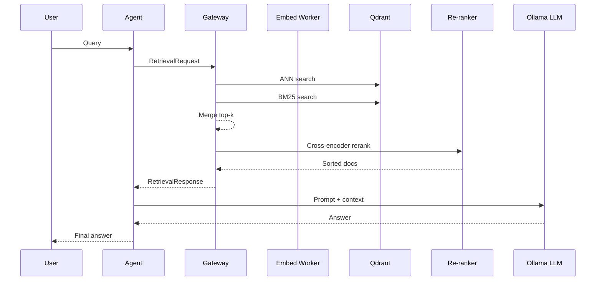

# RAG Service – data_flow_diagram

# Detailed Data‑Flow Diagram (C4 Level 2)

```mermaid
sequenceDiagram
    participant User
    participant Agent
    participant Gateway
    participant Embed as Embed Worker
    participant Vector as Qdrant
    participant Rerank as Re‑ranker
    participant LLM as Ollama LLM

    User->>Agent: Query
    Agent->>Gateway: RetrievalRequest
    Gateway->>Vector: ANN search
    Gateway->>Vector: BM25 search
    Gateway-->>Gateway: Merge top‑k
    Gateway->>Rerank: Cross‑encoder rerank
    Rerank-->>Gateway: Sorted docs
    Gateway-->>Agent: RetrievalResponse
    Agent->>LLM: Prompt + context
    LLM-->>Agent: Answer
    Agent-->>User: Final answer
```