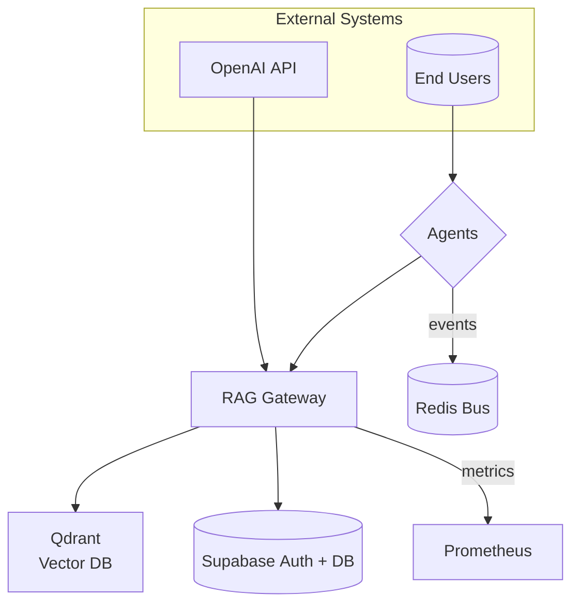

# RAG Service – system_context_diagram

# System Context Diagram (C4 Level 1)

**Trust Boundaries**

* Public Internet: Agents ↔︎ Gateway when outside cluster

* Private VLAN: Gateway ↔︎ Qdrant / Supabase