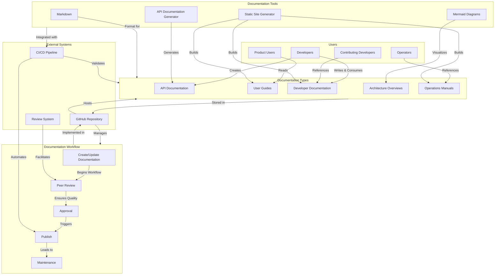

# Alfred Agent Platform Documentation System Overview

*Last Updated: 2025-05-10*
*Owner: Documentation Team*
*Status: Active*

This diagram provides a visual overview of the Alfred Agent Platform documentation system architecture, showing the relationships between documentation components, tools, and processes.

